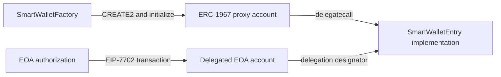
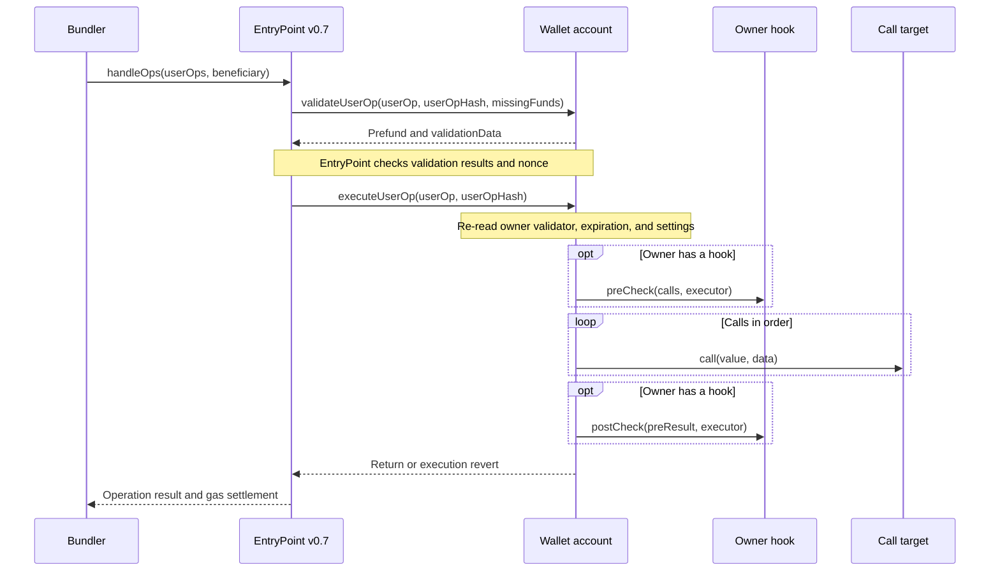

# Smart Wallet Architecture

This document describes the contracts currently implemented in this repository: a shared wallet implementation used by factory-created ERC-1967 proxies and EIP-7702 delegated EOAs. Both account models use the same owner registry, signature validation, and execution logic.

The current ERC-4337 integration targets **EntryPoint v0.7**, pinned by [ERC4337Account](../src/ERC4337Account.sol) to `0x0000000071727De22E5E9d8BAf0edAc6f37da032`. Build settings are defined in [foundry.toml](../foundry.toml): Solidity `0.8.29`, the Cancun EVM target, and optimization via IR. For setup and deployment commands, see the [project README](../README.md#usage).

## System Boundary

The contracts authenticate owners, enforce account permissions, execute calls, and maintain replay-protection state. They expose interfaces for external validators and policy hooks.

Passkey enrollment and storage, transaction construction, bundler and relayer services, paymaster sponsorship, and recovery user interfaces belong to the surrounding application. A Passkey owner does not by itself provide recovery or free transactions: those behaviors require a configured authorization policy and a service that pays transaction fees.

## Account Models and Lifecycle



The implementation supplies code; each proxy or delegated EOA holds its own balance and account state. In the delegated execution context, `address(this)` is the account address.

| Property              | Factory-created proxy                                                | EIP-7702 delegated EOA                               |
| --------------------- | -------------------------------------------------------------------- | ---------------------------------------------------- |
| Account address       | Predicted from the factory, implementation, initial owners, and salt | Existing EOA address                                 |
| Code selection        | ERC-1967 implementation slot                                         | EIP-7702 delegation designator                       |
| Initial authorization | Factory initializes the supplied owners as admins                    | EOA address is recognized as a built-in ECDSA admin  |
| Adding owners         | Authorized self-call to `addOwner`                                   | EOA self-transaction or an authorized execution path |
| Implementation change | Authorized UUPS proxy upgrade                                        | New EIP-7702 authorization selecting the delegate    |

### Factory-Created Accounts

[SmartWalletFactory](../src/SmartWalletFactory.sol) stores an immutable implementation address. `createAccount(initialOwners, salt)` deploys a deterministic ERC-1967 proxy with the factory address embedded in immutable arguments, then initializes it in the same transaction. Its effective CREATE2 salt is `keccak256(abi.encode(initialOwners, salt))`.

Initialization requires a nonempty owner list and assigns `Static.ROOT_KEY_SETTINGS` to each initial owner. [BaseAuthorization](../src/BaseAuthorization.sol) restricts `initialize` to the factory recorded in the proxy's immutable arguments. The implementation contract disables its own initialization in its constructor.

Calling `createAccount` again with the same parameters returns the existing account without reinitializing it. `createAccountWithCall` also invokes `executeWithRelayer`; the supplied call still requires valid wallet authorization.

### Delegated EOAs

For an EOA delegated to `SmartWalletEntry`, `getOwnerConfig(keccak256(abi.encodePacked(address(this))))` returns the built-in ECDSA validator and admin settings, with no expiration or hook. This root key is implicit: it is not stored in the enumerable owner registry and cannot be changed through `addOwner`, `updateOwner`, or `removeOwner`.

Delegated EOAs use this root authority to register additional owners. They do not use the factory-only `initialize` path, and `getImmutableFactory` is only meaningful for the factory's proxy format.

EIP-7702 determines which code executes at an EOA; ERC-4337 determines how a UserOperation is validated and submitted. A delegated account can expose the same execution entry points as a proxy, while this repository's EntryPoint integration and UserOperation format remain v0.7. Delegation itself is a separate EIP-7702 transaction.

## Contract Composition

[SmartWalletEntry](../src/SmartWalletEntry.sol) is the concrete implementation of [SmartWallet](../src/SmartWallet.sol). The manager contracts below are inherited into that implementation. Built-in validator and hook-dispatch libraries execute inline; configured external validators and hooks are separate contracts.

| Component                                                         | Responsibility                                                                                                |
| ----------------------------------------------------------------- | ------------------------------------------------------------------------------------------------------------- |
| [SmartWallet](../src/SmartWallet.sol)                             | Coordinates initialization, batch execution, relayer validation, ERC-4337 validation, and ERC-1271 signatures |
| [OwnerManager](../src/OwnerManager.sol)                           | Maps owner key hashes to validators and packed permissions; enumerates registered owners                      |
| [ValidationManager](../src/ValidationManager.sol)                 | Dispatches signature checks and computes effective signature expiration                                       |
| [ExecutionManager](../src/ExecutionManager.sol)                   | Performs low-level calls and limits forwarded revert data to 256 bytes                                        |
| [ERC4337Account](../src/ERC4337Account.sol)                       | Restricts EntryPoint calls, pays missing prefund, and computes the chainless UserOperation hash               |
| [NonceManager](../src/NonceManager.sol)                           | Tracks relayer sequences and account-level chainless queue floors                                             |
| [AllowanceManager](../src/AllowanceManager.sol)                   | Stores native ETH and ERC-20 allowances for authorized spenders                                               |
| [TransferWithAuthorization](../src/TransferWithAuthorization.sol) | Settles signed transfers and tracks used or canceled authorization nonces per owner                           |
| [ERC712](../src/ERC712.sol)                                       | Supplies wallet EIP-712 domains with and without chain ID                                                     |
| [BaseAuthorization](../src/BaseAuthorization.sol)                 | Defines `onlySelf` and factory-bound initialization                                                           |
| [FallbackHandler](../src/FallbackHandler.sol)                     | Receives ETH and handles ERC-721/ERC-1155 receiver callbacks and interface queries                            |

## Owners, Validators, and Permissions

An owner is identified by a `bytes32 keyHash`. [OwnerManager](../src/OwnerManager.sol) associates it with a validator and a packed settings word:

```text
[255..208: reserved][207..200: admin flag][199..160: expiration][159..0: hook address]
```

The admin field grants permission when its value is exactly `1`. An expiration of `0` means no expiry, and a zero hook address means no policy callback.

| Validator value        | Validation mechanism                                                                 | Built-in key identity                                                           |
| ---------------------- | ------------------------------------------------------------------------------------ | ------------------------------------------------------------------------------- |
| `address(1)`           | [ECDSAValidatorLib](../src/libraries/ECDSAValidatorLib.sol)                          | `keccak256(abi.encodePacked(signerAddress))`                                    |
| `address(2)`           | [PasskeyValidatorLib](../src/libraries/PasskeyValidatorLib.sol) using WebAuthn/P-256 | `keccak256(abi.encodePacked(pubKeyX, pubKeyY))`, with two `uint256` coordinates |
| Other contract address | [IValidator](../src/interfaces/IValidator.sol)                                       | Defined by the external validator                                               |

Addresses `1` and `2` are internal routing sentinels, not separately deployed validator contracts. ECDSA and Passkey validation also support Merkle proofs over the operation digest. This provides membership in a signed set of digests; multiple registered owners and Merkle proofs do not introduce a built-in signature threshold.

Permission checks distinguish two kinds of batch call:

- An active owner can call external targets, subject to its hook.
- A call whose target is the wallet itself requires admin settings. Owner management, allowance changes, and proxy upgrade authorization also enforce `onlySelf` at their entry points.

For a proxy, privileged operations are normally encoded as self-calls within an authorized batch. A delegated EOA's root key can also originate a transaction directly to its own address. `Call.target` is used as supplied: `address(0)` is not a shorthand for the wallet.

Owner enumeration reports explicitly registered keys, including expired keys. It excludes the implicit root key; use `getOwnerConfig` and the expiration checks to determine effective authority.

## Execution Paths

The three batch entry points converge on `SmartWallet._batchCall`:

| Path     | Entry point                                      | Authorization                                                                           | Transaction submission                                                    |
| -------- | ------------------------------------------------ | --------------------------------------------------------------------------------------- | ------------------------------------------------------------------------- |
| Direct   | `execute(calls)`                                 | Active owner selected by `keccak256(abi.encodePacked(msg.sender))`                      | Owner transaction                                                         |
| Relayer  | `executeWithRelayer(batchedCall, validatorData)` | Owner signature, expiration, relayer nonce, and optional chainless checks               | Any caller with a valid signed request pays transaction gas               |
| ERC-4337 | `validateUserOp` followed by `executeUserOp`     | EntryPoint caller, owner signature, effective expiration, and optional chainless checks | Bundler submits `handleOps`; EntryPoint handles prefunding and settlement |

Direct execution authenticates the transaction sender; it does not accept a Passkey signature. Passkey owners use a signature-bearing path such as relayer execution or a UserOperation.

### Shared Batch Execution

The account calls the owner's hook `preCheck`, executes each `Call` in order, then calls `postCheck`. A hook or target revert rolls back that batch. Each low-level call carries the supplied target, value, and calldata.

For direct and relayer calls, a batch failure reverts the enclosing wallet call, including relayer nonce updates. In the ERC-4337 path, EntryPoint separates validation from execution: failure of the execution batch can leave validation-time nonce and queue changes in place while the bundle continues.

### ERC-4337 Validation and Execution



`validateUserOp` requires the operation's `callData` to begin with `executeUserOp.selector`. The remaining bytes encode `Call[]`; they are not the normal ABI encoding of `executeUserOp(userOp, userOpHash)`:

```solidity
userOp.callData = abi.encodePacked(
    IERC4337Account.executeUserOp.selector,
    abi.encode(calls)
);
```

EntryPoint recognizes the selector and supplies the full UserOperation to the callback. At execution time, the wallet re-reads the signing owner's current validator and settings. Removing or expiring an owner earlier in the same bundle therefore prevents that owner from executing a previously validated operation.

## Signature Domains and Replay Protection

The wallet EIP-712 domain uses name `SmartWallet` and version `2.0.0`, as defined in [Static](../src/libraries/Static.sol). Regular typed-data hashes include the current chain ID and account address. Chainless relayer hashes omit only the chain ID from this domain.

| Signed operation         | Digest construction                                                                         | Signature envelope                              |
| ------------------------ | ------------------------------------------------------------------------------------------- | ----------------------------------------------- |
| Relayer batch            | Wallet EIP-712 hash of `batchedCall.hash(validUntil, IMPLEMENTATION)`                       | `keyHash (32) + validUntil (6) + validatorData` |
| UserOperation            | `toEthSignedMessageHash(keccak256(abi.encode(baseUserOpHash, validUntil, IMPLEMENTATION)))` | `keyHash (32) + validUntil (6) + validatorData` |
| Validator-based ERC-1271 | Wallet EIP-712 hash of `MessageSignLib.hash(hash, validUntil, IMPLEMENTATION)`              | `keyHash (32) + validUntil (6) + validatorData` |
| Transfer authorization   | Wallet EIP-712 hash of `keccak256(abi.encode(structHash, signerKeyHash, IMPLEMENTATION))`   | `keyHash (32) + validatorData`                  |

The table describes digest construction; `validatorData` encoding depends on the selected validator. Relayer batches use [BatchedCallLib](../src/libraries/BatchedCallLib.sol), ERC-1271 uses [MessageSignLib](../src/libraries/MessageSignLib.sol), and transfer authorization details are documented in the [README](../README.md#transferwithauthorization).

For a regular UserOperation, obtain `baseUserOpHash` from the v0.7 EntryPoint's `getUserOpHash`. For a chainless operation, use the wallet's `getUserOpHashWithoutChainId`. Their underlying hashes are respectively:

```solidity
// UserOperationLib.hash uses the v0.7 packed operation encoding.
keccak256(abi.encode(userOp.hash(), entryPoint, block.chainid));
keccak256(abi.encode(userOp.hash(), entryPoint));
```

`isValidSignature` also has an EOA compatibility path for signatures of exactly 65 bytes. It recovers a signer directly from the supplied digest and accepts only `address(this)`. That path adds no domain separator, expiration field, or implementation binding; replay boundaries come from the digest supplied by the calling protocol. ERC-1271 validation itself does not consume a nonce.

Replay state is owned by the component handling the request:

| Request                                  | Replay state                                                                               |
| ---------------------------------------- | ------------------------------------------------------------------------------------------ |
| Direct transaction                       | Transaction sender's network nonce                                                         |
| Relayer batch                            | Wallet mapping from `uint192 nonceKey` to `uint64 sequence`                                |
| UserOperation                            | EntryPoint nonce state for the account and nonce key                                       |
| Chainless relayer batch or UserOperation | Corresponding sequence above, plus the wallet's shared queue floor for each operation type |
| Transfer authorization                   | Wallet mapping from `(ownerKeyHash, authorizationNonce)` to used/canceled state            |

Expiration limits how long a request is valid; nonce state prevents repeated execution. UserOperation validation returns the earlier nonzero value of the signed `validUntil` and owner expiration to EntryPoint.

## Chainless Operations

[ChainlessLib](../src/libraries/ChainlessLib.sol) recognizes chainless requests using `nonce >> 96 == 196`. The complete layout is:

```text
[255..96: prefix 196][95..80: operation type][79..64: queue ID][63..0: sequence]
```

```solidity
uint256 nonce =
    (Static.CHAINLESS_NONCE_KEY << 96) |
    (uint256(operationType) << 80) |
    (uint256(queueId) << 64) |
    uint256(sequence);
```

The prefix is not a literal nonce of `196` and is not the entire 192-bit nonce key. The operation type and queue ID are also part of that key.

A chainless request requires an admin owner. Every included call must target the wallet itself and use the `addOwner` or `upgradeToAndCall` selector. Operation type is an independent queue namespace; the convention `0 = addOwner`, `1 = upgrade` is not enforced as a selector mapping.

Each operation type starts with a queue floor of `0`. Accepting queue `N` advances the floor to `N + 1`, invalidating all queues at or below `N` for that type. Queue `65535` is reserved, so `65534` is the highest usable queue. Relayer and ERC-4337 paths share these account-level floors even though their sequence counters are separate.

Removing the chain ID permits reuse across compatible chains; it does not synchronize account state. Successful reuse requires matching wallet and implementation addresses, compatible owner configuration, and acceptable nonce and queue state on every target chain.

## Asset Authorization and Policy Hooks

[AllowanceManager](../src/AllowanceManager.sol) and [TransferWithAuthorization](../src/TransferWithAuthorization.sol) provide distinct ways to authorize transfers:

- **Persistent allowance:** an authorized self-call to `batchApproveToken` records token/spender limits. The spender later calls `transferFromNative` or `transferFromToken`. Those withdrawals use stored allowances and do not revalidate an owner signature or run an owner hook; removing an owner does not clear allowances.
- **Signed transfer:** an owner authorizes a particular token, recipient, amount, time window, and nonce. `executeTransferWithAuthorization` permits any submitter; `receiveWithAuthorization` additionally requires the caller to be the payee. Both settle through the signing owner's configured hook.

Transfer authorizations are valid strictly between `validAfter` and `validBefore`. Settlement marks the owner's nonce used before external interactions; a later revert rolls back that mark. Cancellation shares the same owner-scoped nonce state. An active owner can cancel its own authorization, an active admin can cancel another owner's authorization, and an unsigned cancellation requires a wallet self-call. Removing and re-adding an owner does not reset used or canceled nonces.

[HookLib](../src/libraries/HookLib.sol) dispatches policy callbacks according to the operation:

| Operation                         | Configured hook behavior                                                                                                                   |
| --------------------------------- | ------------------------------------------------------------------------------------------------------------------------------------------ |
| Batch execution                   | Calls `IHook.preCheck` and `postCheck`; a revert fails the batch                                                                           |
| Transfer authorization settlement | Requires ERC-165 support for `IHookTransferAuthorization`, then calls its pre/post callbacks; incompatibility or a revert fails settlement |
| Validator-based ERC-1271          | Requires ERC-165 support for `IHook` and an approving `isValidSignatureCheck`; failure rejects the signature                               |

The implicit EOA root key has no hook. Transfer settlement uses a transient reentrancy guard; this guard is not a wallet-wide restriction on every execution path.

## Storage and Implementation Changes

[SmartWalletEntry](../src/SmartWalletEntry.sol) places inherited Solidity state at the custom storage base identified by `SmartWallet.ERC7201.CustomStorage`. The layout includes owner records, relayer nonces, and allowances. [ERC7201](../src/ERC7201.sol) exposes the namespace and root as metadata; it does not allocate a separate namespace for every manager.

Additional state is isolated explicitly:

- Chainless queue floors use the slot derived from `keccak256("okx.smart-wallet.nonce-manager.chainless-queue")`.
- Transfer authorization nonces use their own ERC-7201 namespace, `SmartWallet.ERC7201.TransferAuthorization`.
- The ERC-1967 proxy implementation pointer is separate from these wallet state regions.

A proxy upgrade calls `upgradeToAndCall` through an admin-authorized self-call. `_authorizeUpgrade` enforces `onlySelf`, and the UUPS implementation checks the new target's `proxiableUUID`. Storage compatibility must preserve inherited field ordering, types, explicit slots, and namespace roots. The factory's immutable implementation determines newly created accounts; upgrading one proxy does not update other accounts or the factory.

For direct EIP-7702 delegation, the EOA's code designator selects the implementation. Updating an ERC-1967 storage slot does not change that designator; changing the delegate requires a new EIP-7702 authorization. See the [EIP-7702 specification](https://eips.ethereum.org/EIPS/eip-7702#delegation-designation) for code resolution rules.

The wallet's `IMPLEMENTATION` immutable identifies the code currently executing. Relayer, UserOperation, validator-based ERC-1271, and transfer authorization digests bind this value, so changing implementation invalidates signatures bound to the previous one. The raw 65-byte ERC-1271 compatibility path is the exception described above. Preserving storage also preserves consumed nonce and authorization state.

## Extension Points and Current Scope

External [validators](../src/interfaces/IValidator.sol) can implement additional credential or signature policies. Per-owner [execution hooks](../src/interfaces/IHook.sol) and [transfer hooks](../src/interfaces/IHookTransferAuthorization.sol) can impose operation-specific constraints. These contracts are part of the authorization boundary for the owners that select them.

ZKEmail, SocialID, guardian recovery, and threshold multisignature schemes are not implemented as built-in modules in `src/`. They require a concrete external validator or another explicitly authorized integration. Existing owner management provides the primitives for adding, replacing, and removing keys; it does not define a recovery ceremony, delay, or quorum by itself.

## Implementation and Test References

| Behavior                                          | Tests                                                                                                                                |
| ------------------------------------------------- | ------------------------------------------------------------------------------------------------------------------------------------ |
| Factory-bound initialization                      | [InitializationAuth.t.sol](../test/InitializationAuth.t.sol)                                                                         |
| Built-in EOA owner and delegated execution        | [ERC7702.t.sol](../test/ERC7702.t.sol)                                                                                               |
| EntryPoint validation and callback selector       | [ValidateUserOp.t.sol](../test/ValidateUserOp.t.sol), [UserOpSelector.t.sol](../test/UserOpSelector.t.sol)                           |
| Owner revocation between validation and execution | [RevokedOwnerUserOp.t.sol](../test/RevokedOwnerUserOp.t.sol)                                                                         |
| Chainless queue rules and hash domains            | [ChainlessExecution.t.sol](../test/ChainlessExecution.t.sol)                                                                         |
| Proxy upgrade permissions and state preservation  | [SmartWalletUpgrade.t.sol](../test/SmartWalletUpgrade.t.sol)                                                                         |
| Signature and transfer policy enforcement         | [IsValidSignature.t.sol](../test/IsValidSignature.t.sol), [TransferWithAuthorization.t.sol](../test/TransferWithAuthorization.t.sol) |
| Persistent spender allowances                     | [AllowanceManager.t.sol](../test/AllowanceManager.t.sol)                                                                             |

See the [documentation index](./README.md) for the remaining reference material.
