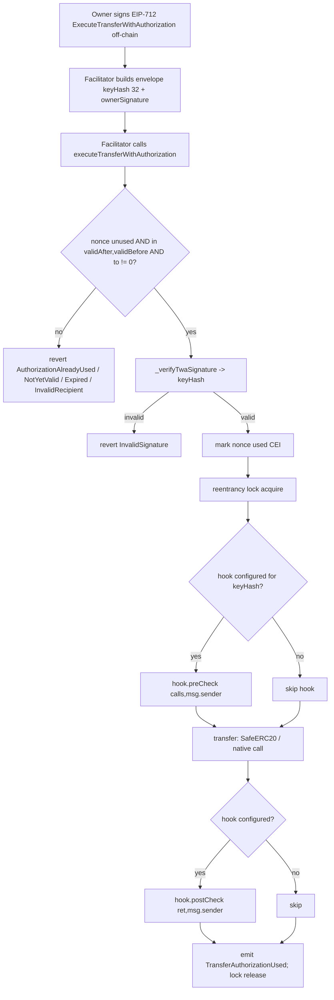
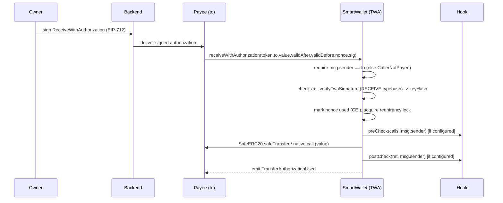

# DESIGN.md — 带授权的账户级转账（TWA）

> 这是 OKX SmartWallet 账户 TWA 功能的规范性技术设计文档，是合约、模块、函数、状态、事件、错误、资金流转及状态机的唯一权威来源。本文档直接由 PRD（`docs/process/REQUIREMENTS.md`）、EIP 草案补充说明、经验证的现有代码库、Circle EIP-3009 技术背景，以及所选模式参考（账户抽象、可升级性）生成。`REQUIREMENTS_ANALYSIS.md` 仅作为覆盖率/准备情况索引使用。
>
> 目标链：EVM，以太坊主网（chainId 1），**Cancun**。codebase_mode：`existing_code_change`（初始）。Solidity `^0.8.29`，Foundry。

---

## 1. 设计目标与非目标

### 1.1 智能合约职责（链上）
- **严格**实现 `ITransferWithAuthorization`（PRD §2.1，FR-1..FR-5）——函数/事件/错误签名已冻结，本文档仅设计函数体。
- 通过 PRD 固定的 `_verifyTwaSignature` 路径（PRD §7，G-4）验证链下 EIP-712 所有者签名，复用账户现有的验证器路由。
- 使用从账户原生/4337 nonce 中隔离的随机 `bytes32` nonce，执行一次性、时间窗口限定、收款方绑定的授权（PRD §5 不变量 1-4，G-3）。
- **通过签名密钥的消费策略 Hook** 完成转账（任何 ERC-20 或原生资产），与现有 `execute` 路径同构（PRD FR-1 规则 6，§5 不变量 5，G-5）。
- 在转账**之前**标记 nonce 已用（CEI），并用瞬态存储重入锁保护原生资产路径（PRD NFR-2，R-1）。
- 允许所有者取消未使用的授权（FR-3），并暴露 nonce 状态 + 域分隔符的 getter 函数及 ERC-165 检测（FR-4，FR-5）。

### 1.2 非目标 / 链下职责
- 不支持批量授权、链上代币白名单/账户限额、链上暂停/熔断开关、Paymaster、多链单签名、持续授权额度（PRD §3.2 — 均由其他模块覆盖或超出范围）。
- 链下（PRD §8.2）：EIP-712 载荷构造、签名收集、中继节点选择/提交、接收 UI 元数据、事件索引、每个密钥的 Hook 策略配置。

### 1.3 直接使用的 PRD 输入
PRD §2.1（接口）、§2.2-2.5、FR-0..FR-5（含所有 AC + FR-1 边界情况）、§5（状态 + 5 个不变量）、NFR-1..4、§7（技术要求 + `_verifyTwaSignature` 7 步规范 + typehash 可见性 + 域 + UUPS/ERC-7201 + cancun + EIP-170）、§8（数据 + 权限）、DEP-1..8、§10（8 个指标）、R-1..R-7/R-9、§12（交接）。EIP 草案：3 个 typehash 常量值、`NATIVE_ASSET`、`INTERFACE_ID`、摘要推导、nonce 模型。

### 1.4 PRD 与技术设计的边界（PRD §12）
**PRD 已固定（直接采用）：** `_verifyTwaSignature` 路径 + `keyHash(32)‖ownerSignature` 封装；直接使用 `hashTypedData(structHash)` 计算摘要，**不**包裹 ERC-1271/`MessageSignLib`；同一 `keyHash` 既路由验证器又选择 Hook；三个 typehash + `INTERFACE_ID` 均为 `public constant`；EIP-712 域 = 账户现有域（`name="SmartWallet"`，`version="1.1.0"`，`verifyingContract = account`）；通过 EIP-712 typehash + 域实现跨版本重放保护。
**技术设计阶段决定（Stage 4.0）：** 接口文件布局；单合约内联 mixin；`SIGNATURE_ENVELOPE_MIN_LENGTH` 值（设计值：32）；通过 `_batchCall` 语义调用 Hook；瞬态重入锁实现；ERC-7201 命名空间字符串 + 槽；`optimizer_runs` 二分搜索满足 EIP-170。

---

## 2. 项目结构

| 项目 | 值 |
|------|-------|
| 链 / 框架 | EVM（ETH 主网 chainId 1，Cancun）/ Foundry |
| Solidity | `^0.8.29`（现有，`foundry.toml:5`） |
| 源码路径 | `src/`（Stage 1.0 已确认） |
| 测试路径 | `test/` |
| 脚本路径 | `script/` |
| 依赖库 | `lib/`（OpenZeppelin、solady、account-abstraction、webauthn-sol、smart-wallet-recovery） |
| codebase_mode | `existing_code_change`（初始 / 首次采用） |
| 基线构建 | **失败** — 根本原因仅为环境问题：私有/嵌套依赖 `smart-wallet-recovery`（需要认证）和 `webauthn-sol`→`FreshCryptoLib`（嵌套子模块）在 bootstrap 环境中无法解析（Stage 1.0 `output.md`，`EXISTING_CODEBASE_BASELINE.md`）。非源码缺陷；Stage 4.0 必须恢复依赖访问。参见风险登记册 RR-4。 |

### 文件 / 模块计划
| 文件 | 变更 | 类型 |
|------|--------|------|
| `src/interfaces/ITransferWithAuthorization.sol` | **新增** — 来自 PRD §2.1 的冻结接口（函数、事件、错误） | B |
| `src/TransferWithAuthorization.sol` | **新增** — 实现该接口的抽象 mixin；由 `SmartWallet` 继承；编译内联（无 facade / 无外部库链接 — PRD §7） | B |
| `src/SmartWallet.sol` | **修改** — 将 `TransferWithAuthorization` 加入继承列表；暴露 `supportsInterface` 覆写 | A |
| `src/FallbackHandler.sol`（或 mixin 覆写） | **修改** — 在 ERC-165 检测中添加 `INTERFACE_ID = 0x86c5a9e1` | A |
| `foundry.toml` | **修改** — `evm_version` `shanghai` → `cancun`；针对 EIP-170 重新调整 `optimizer_runs` | A |

新的授权 nonce 存储位于其**独立的** ERC-7201 命名空间中，通过汇编存储访问器访问（PRD §7，R-4），与账户现有的 `layout at 0x653ff6…` 区域相互独立。

---

## 2.5. 现有代码基线与增量计划

> `existing_code_change` 模式的必要内容。证据来源：`.oli-work/stage02-analysis/existing-code.md`、`.oli-work/stage02-analysis/patterns.md`、`.oli-work/stage02-analysis/security.md`，以及下方引用的直接文件读取。

### 已审阅的代码 / 文档 / 测试 / 脚本
`src/SmartWallet.sol`、`ExecutionManager.sol`、`Types.sol`、`OwnerManager.sol`、`ValidationManager.sol`、`ERC712.sol`、`ERC7201.sol`、`SmartWalletEntry.sol`、`FallbackHandler.sol`、`BaseAuthorization.sol`、`NonceManager.sol`、`interfaces/IHook.sol`、`libraries/Static.sol`、`libraries/DecodeLib.sol`（引用）、`foundry.toml`；技术上下文 `contracts/v2/EIP3009.sol`；现有测试清单（`test/Hook.t.sol`、`test/Validation.t.sol`、`test/Execution.t.sol`、`test/ERC712.t.sol` 等，来自基线清单）。Stage 1.0 `output.md` 及 `EXISTING_CODEBASE_BASELINE.md`。

### 现有架构 / 模式 / 约定
- **模块化智能账户**：`SmartWallet`（抽象）继承 ERC7201、ERC4337Account、OwnerManager、NonceManager、ValidationManager、ExecutionManager、ERC712、FallbackHandler、Initializable、AllowanceManager、UUPSUpgradeable；以 `SmartWalletEntry` 形式部署（`SmartWallet.sol:29-42`，`SmartWalletEntry.sol:9`）。
- **密钥模型**：所有者以 `keyHash` 表示，映射到 `OwnerManager` 中的验证器和打包设置（`isAdmin | expiration | hook`）（`_ownerValidators`、`_ownerSettings`、`getHook`/`isAdmin`/`getExpiration`、`getVerifiedValidator`）。
- **Hook 模式**：`_batchCall(Call[],keyHash)` 查询每个密钥的 Hook，并在 `_call` 前后分别调用 `IHook.preCheck(calls,msg.sender)` 和 `postCheck(ret,msg.sender)`（`SmartWallet.sol:146-172`）。
- **签名/验证**：`getVerifiedValidator(keyHash)` + `_validateSignature(validator,keyHash,digest,sig)`；ECDSA=addr(1)，passkey=addr(2)，外部验证器通过 try/catch 失败关闭（`ValidationManager.sol:29-67`）。
- **EIP-712**：solady；`hashTypedData(structHash)`（`ERC712.sol:13`），域 `SmartWallet`/`1.1.0`（`Static.sol:22-23`）。
- **存储**：ERC-7201 命名空间；现有 `SmartWallet.ERC7201.CustomStorage` 根 `0x653ff6dc…`；整个账户使用 Solidity 原生 `layout at` 指令。
- **约定**：接口中使用自定义错误（`ISmartWallet`、`IOwnerManager`）；每次状态变更触发事件；ERC-20 使用 SafeERC20（`IERC20(token).safeTransfer`）；外部 API 使用 NatSpec；`onlySelf`/`onlyFactory`/`onlyEntryPoint` 修饰符。

### 请求的增量、保留的行为、兼容性
- **增量**：复用上述原语新增 TWA 结算接口（FR-1..FR-5）。TWA 逻辑为 B 类；ERC-165 + 继承 + `foundry.toml` 为 A 类。
- **保留**：所有现有 execute/relayer/UserOp 路径及其 38 字节签名封装；所有者/验证器/Hook/nonce 语义；现有 ERC-7201 `CustomStorage` 布局；现有 ERC-165 id；UUPS `onlySelf` 升级权限；EIP-712 域。TWA 不修改也不重排现有存储。
- **兼容性**：ABI 纯增量添加（新增外部函数、事件、错误、一个新 ERC-165 id）。现有接口的事件模式/自定义错误不变。部署地址不受影响（同一可升级账户）。现有事件的后端索引不受影响。

### 全局影响审查
- **存储**：新 nonce 映射位于独立 ERC-7201 命名空间——与 `0x653ff6dc…` 无重叠（非碰撞验证是 Stage 4.0 的存储布局门控；R-4）。
- **字节码（EIP-170）**：TWA 函数 + 三个 `public constant` typehash getter + `INTERFACE_ID` 会增大运行时字节码；必须重新调整 `optimizer_runs` 并重新检查 `forge build --sizes`（R-9，NFR-1）。
- **构建/EVM**：`evm_version` 必须从 shanghai 迁移至 cancun 以支持 EIP-1153；cancun 是 shanghai 的超集，现有合约保持有效（DEP-6）。
- **安全不变量**：TWA 复用验证器 + Hook 原语而不修改它们；新增重入面是原生 `to.call{value}`，通过 CEI + 瞬态锁缓解（R-1）。未发现 TWA 对现有访问控制、资金流转或状态机有更广泛影响——TWA 仅新增入口点。

### 现有代码风险登记册

| 区域 / 文件 | 观察到的风险或问题 | 增量是否涉及？ | 处理方式 |
|-------------|------------------------|-------------------|----------|
| RR-1 `foundry.toml:6` `evm_version="shanghai"` | EIP-1153 `TSTORE`/`TLOAD`（PRD 强制要求的瞬态重入锁）在 shanghai 下无法编译。 | 是——TWA 引入了瞬态锁 | **增量修复**：Stage 4.0 设置 `evm_version=cancun`（PRD §7，DEP-6）。 |
| RR-2 `ExecutionManager._call`（`:11-40`） | 原始汇编 `call` 不捕获返回数据：在 `execute` 路径上，返回 `false` 的非标准 ERC-20 不会 revert。 | TWA 依赖 Hook 语义但对其自身的 ERC-20 路径使用 **SafeERC20**，因此 TWA 不受影响；`execute` 路径本身超出 TWA 范围。 | **标记超出范围**：TWA 按 PRD §12 使用 SafeERC20；修改 `execute` 超出本次增量范围。 |
| RR-3 `foundry.toml:9` `optimizer_runs=2000` | 添加 TWA + public-constant typehash getter 会增大运行时字节码；账户可能接近 24,576 字节的 EIP-170 上限。 | 是 | **增量修复**：Stage 4.0 二分搜索 `optimizer_runs` 并重新验证 `--sizes` + gas（R-9，NFR-1）。 |
| RR-4 基线构建（依赖） | 构建失败：`smart-wallet-recovery`（私有认证）和 `webauthn-sol`→`FreshCryptoLib`（嵌套子模块）的源码在此环境中无法解析。 | 否——属于环境问题，非代码问题 | **标记超出范围**：Stage 4.0 恢复依赖访问；非 TWA 设计缺陷（Stage 1.0 基线 `failed`）。 |
| RR-5 `FallbackHandler.supportsInterface` 平铺 `||` if 链（`:32-44`） | 添加新接口 id 需要编辑该链或进行覆写。 | 是 | **增量修复**：TWA 覆写 `supportsInterface`，返回 `id == INTERFACE_ID \|\| super.supportsInterface(id)`。 |

在已审阅的代码中，未发现 TWA 增量所涉及或依赖的其他已有缺陷或不健全模式。

---

## 3. 架构概览

| 模块 | 职责 | 关系 | 外部依赖 |
|--------|----------------|---------------|---------------|
| `ITransferWithAuthorization`（新接口） | 冻结 ABI：5 个函数、2 个事件、5 个错误（PRD §2.1） | 由 mixin 实现 | — |
| `TransferWithAuthorization`（新 mixin） | TWA 逻辑：验证、nonce/时间窗口检查、CEI 标记已用、Hook 包裹结算、取消、getter、ERC-165 id | 由 `SmartWallet` 继承；调用 `OwnerManager.getVerifiedValidator`/`getHook`/`_ownerSettings`、`ValidationManager._validateSignature`、`ERC712.hashTypedData`、`IHook`、`ExecutionManager`（语义） | OZ `SafeERC20`/`IERC20`；solady `EIP712`（通过 `ERC712`） |
| `OwnerManager`（现有） | 验证器路由 + 每个密钥的设置/Hook | 提供 `getVerifiedValidator`、`getHook`、`isAdmin`、`_ownerSettings` | — |
| `ValidationManager`（现有） | 签名验证分发（ECDSA/passkey/外部） | 提供 `_validateSignature` | ECDSA/Passkey 验证器库 |
| `ERC712`（现有） | EIP-712 类型化数据哈希 + 域 | 提供 `hashTypedData` | solady `EIP712` |
| `FallbackHandler`（现有） | ERC-165 检测 | 为 `INTERFACE_ID` 扩展 | — |
| `BaseAuthorization`（现有） | `onlySelf` | 由取消形式 B 使用 | — |
| 每个密钥的消费策略 Hook（外部，所有者配置） | 通过 `preCheck`/`postCheck` 执行每个密钥的限额/白名单 | 由结算路径调用 | 半可信（所有者配置） |

**核心原则（G-5 / R-7）：** 由 `_verifyTwaSignature` 恢复并验证的单个 `keyHash` 同时用于路由验证器**和**选择消费策略 Hook——从结构上保证了"签名的密钥 == 其 Hook 约束消费的密钥"，从而防止受限的会话/代理密钥通过 TWA 绕过自身 Hook。

---

## 4. 架构图

### 4.1 架构 / 组件图
```mermaid
graph TD
    Relayer[Relayer / Facilitator] -->|executeTransferWithAuthorization| TWA
    Payee[Payee contract] -->|receiveWithAuthorization| TWA
    Self[Account self-call / owner via execute] -->|cancelTransferAuthorization| TWA
    subgraph SmartWalletEntry (UUPS account)
      TWA[TransferWithAuthorization mixin]
      OM[OwnerManager: getVerifiedValidator / getHook / _ownerSettings]
      VM[ValidationManager: _validateSignature]
      E712[ERC712: hashTypedData / domain]
      EM[ExecutionManager: _call semantics]
      NS[(ERC-7201 TWA namespace: mapping bytes32 -> bool)]
    end
    TWA --> OM
    TWA --> VM
    TWA --> E712
    TWA --> NS
    TWA -->|preCheck/postCheck| Hook[Per-key Spending Policy Hook]
    TWA -->|SafeERC20.safeTransfer / native call| Asset[ERC-20 token / native recipient]
```

### 4.2 核心业务流程（facilitator 结算，FR-1）


### 4.3 序列图（receive 路径，FR-2）


### 4.4 状态转换图（授权 nonce）
```mermaid
stateDiagram-v2
    [*] --> Unused
    Unused --> Used: executeTransferWithAuthorization / receiveWithAuthorization (success)
    Unused --> Canceled: cancelTransferAuthorization (form A signed / form B self-call)
    Used --> [*]
    Canceled --> [*]
    note right of Used: terminal; on-chain flag = true
    note right of Canceled: terminal; treated as used (flag = true)
```

---

## 5. 合约 / 模块关系设计

- **继承**：`TransferWithAuthorization` 是一个抽象 mixin，被加入 `SmartWallet` 的继承列表（与现有 manager 并列）。它被编译内联进单一的 `SmartWalletEntry` 字节码——无独立部署的 facade，也无链接的外部库（PRD §7"单合约内联"）。
- **组合**：mixin 不持有验证器/Hook 状态；它读取 `OwnerManager` 状态（`_ownerSettings`、`getHook`、`getVerifiedValidator`），并调用 `ValidationManager._validateSignature` 和 `ERC712.hashTypedData`。它仅持有自己的 ERC-7201 nonce 命名空间。
- **库使用**：ERC-20 路径使用 OZ `SafeERC20`/`IERC20`（PRD §12——保留返回值检查）；通过 `ERC712` 间接使用 solady `EIP712`。
- **存储隔离**：TWA nonce 映射位于专用 ERC-7201 命名空间中，通过汇编访问（`_getTransferAuthorizationStorage`），与账户的 `layout at 0x653ff6…` 区域相互独立（PRD §7，R-4，DEP-3）。
- **权限/业务关系**：复用 `execute` 类授权（验证器路由 + Hook）；TWA 新增无权限的 `execute`/收款方限定的 `receive` 入口点，以及所有者限定的 `cancel`。UUPS 升级权限（`_authorizeUpgrade onlySelf`）保持不变。

---

## 6. 模块设计 — `TransferWithAuthorization`

| 方面 | 详情 |
|--------|--------|
| 名称 | `TransferWithAuthorization`（抽象 mixin），实现 `ITransferWithAuthorization` |
| 职责 | 所有 TWA 行为：验证、nonce/时间窗口/收款方检查、CEI 标记已用、Hook 包裹结算、取消、getter、ERC-165 |
| 持有状态 | ERC-7201 命名空间 `SmartWallet.ERC7201.TransferAuthorization` → `struct { mapping(bytes32 => bool) authorizationStates; }`；一个瞬态存储重入标志（EIP-1153） |
| 公共常量 | `EXECUTE_TRANSFER_WITH_AUTHORIZATION_TYPEHASH`、`RECEIVE_WITH_AUTHORIZATION_TYPEHASH`、`CANCEL_TRANSFER_AUTHORIZATION_TYPEHASH`、`INTERFACE_ID = 0x86c5a9e1`、`NATIVE_ASSET`（= `Static.NATIVE_ETH`）、`SIGNATURE_ENVELOPE_MIN_LENGTH = 32`——均为 `public constant`（PRD §7） |
| 暴露的函数 | FN-001..FN-006（外部）；FN-101..FN-106（内部/私有辅助函数 + 修饰符） |
| 依赖 | `OwnerManager`、`ValidationManager`、`ERC712`、`IHook`、OZ SafeERC20 |
| 权限模型 | execute = 无权限；receive = `msg.sender==to`；cancel = 所有者签名（形式 A）或 `onlySelf`（形式 B）；getter = view |
| 不变量 | INV-NONCE-ONCE、INV-NONCE-ISOLATION、INV-RECIPIENT-BOUND、INV-CEI、INV-HOOK-ISOMORPHISM、INV-TIME-WINDOW、INV-TYPESEP（见 §10） |
| 失败模式 | `AuthorizationAlreadyUsed`、`AuthorizationNotYetValid`、`AuthorizationExpired`、`InvalidRecipient`、`CallerNotPayee`、`InvalidSignature` + `NonAdminSelfCall`（现有基础错误，复用），重入锁 revert，Hook revert，SafeERC20/原生调用 revert |
| 事件 | `TransferAuthorizationUsed`、`TransferAuthorizationCanceled` |
| 测试重点 | 重放/跨类型/跨链，时间窗口边界，Hook 执行与 execute 对比，原生资产重入，非标准 ERC-20（USDT），零地址收款方，ERC-1271 包裹摘要必须失败 |

### 公共常量值（权威来源——EIP 草案；请勿以不同方式重新计算）
```
EXECUTE_TRANSFER_WITH_AUTHORIZATION_TYPEHASH = 0xe751bf1b144414a77b82ede1d2a433edc347fef283ab5e53e96f438392517b3c
RECEIVE_WITH_AUTHORIZATION_TYPEHASH          = 0xd8a04c474fcb45b6fb4b17a80506c180af4818903f1ace6c1ff59053338529fd
CANCEL_TRANSFER_AUTHORIZATION_TYPEHASH       = 0xf30be15aedf9b01d0dac5525241af3753865a4968ffb9fb1a7ad6d2553d29f8e
INTERFACE_ID                                 = 0x86c5a9e1   // executeTransferWithAuthorization.selector ^ receiveWithAuthorization.selector
NATIVE_ASSET                                 = 0xEeeeeEeeeEeEeeEeEeEeeEEEeeeeEeeeeeeeEEeE   // = Static.NATIVE_ETH (ERC-7528)
```
类型字符串（用于 typehash，必须完全匹配）：
- `ExecuteTransferWithAuthorization(address token,address from,address to,uint256 value,uint256 validAfter,uint256 validBefore,bytes32 authorizationNonce)`
- `ReceiveWithAuthorization(address token,address from,address to,uint256 value,uint256 validAfter,uint256 validBefore,bytes32 authorizationNonce)`
- `CancelTransferAuthorization(bytes32 authorizationNonce)`

---

## 7. 接口设计 — `ITransferWithAuthorization`（冻结，PRD §2.1）

> 签名由 PRD 冻结；仅实现函数体。后端集成详情见 `INTERFACE_SPEC.md`；请勿在此重复行为描述。

```solidity
interface ITransferWithAuthorization {
  event TransferAuthorizationUsed(address indexed token, address indexed from, address indexed to, uint256 value, bytes32 authorizationNonce);
  event TransferAuthorizationCanceled(address indexed authorizer, bytes32 indexed authorizationNonce);

  error AuthorizationAlreadyUsed(bytes32 authorizationNonce);
  error AuthorizationNotYetValid(uint256 validAfter);
  error AuthorizationExpired(uint256 validBefore);
  error InvalidRecipient(address to);
  error CallerNotPayee(address caller, address to);

  function executeTransferWithAuthorization(address token, address to, uint256 value, uint256 validAfter, uint256 validBefore, bytes32 authorizationNonce, bytes calldata signature) external; // permissionless
  function receiveWithAuthorization(address token, address to, uint256 value, uint256 validAfter, uint256 validBefore, bytes32 authorizationNonce, bytes calldata signature) external; // only msg.sender == to
  function cancelTransferAuthorization(bytes32 authorizationNonce, bytes calldata signature) external;
  function transferAuthorizationState(bytes32 authorizationNonce) external view returns (bool used);
  function TRANSFER_AUTHORIZATION_DOMAIN_SEPARATOR() external view returns (bytes32);
}
```

注意事项：
- `from` **不是**函数参数；合约使用 `address(this)` 并将其包含在已签名的结构体中（EIP 草案"from 在 EIP-712 中但不在函数参数中"）。
- `InvalidSignature()`（由验证路径和 FR-1-AC-4 / FR-1 边界情况使用）是**现有的** `ISmartWallet.InvalidSignature()` 错误，复用——它有意不属于冻结接口错误集。
- `NonAdminSelfCall()`（FN-103 步骤 3 自调用目标守卫；DR-003）同样是**现有的** `ISmartWallet.NonAdminSelfCall()` 错误（`ISmartWallet.sol:10`），复用以实现 execute 同构，且有意不属于冻结的 TWA 接口错误集。
- EIP 参考实现中的 `NativeTransferFailed()` **不被采用**（PRD §2.1 为权威来源）；原生发送失败通过底层调用的冒泡/显式 revert 来回退（Stage 4.0 可复用现有的原生转账错误或以 returndata 进行 revert）。

---

## 8. 权威来源与状态模型

### 8.1 TWA 持有的链上状态
| 状态 | 类型 | 所有者 | 权限 | 备注 |
|-------|------|-------|-----------|-------|
| `authorizationStates` | ERC-7201 命名空间 `SmartWallet.ERC7201.TransferAuthorization` 中的 `mapping(bytes32 => bool)` | TWA mixin | 链上权威（PRD §8.1"授权状态"，§8.2） | `true` = 已用**或**已取消（合并；PRD 不变量 1 + FR-4"被 cancel 的 nonce 视为已用"）。区分仅可通过事件观察（NFR-4）。 |
| 重入标志 | 瞬态（EIP-1153） | TWA mixin | 瞬态（每笔交易结束后清除） | 保护原生资产结算（R-1，NFR-2） |

### 8.2 从现有模块读取的状态（不由 TWA 持有）
`_ownerSettings[keyHash]`（打包的 isAdmin/expiration/hook）、`_ownerValidators[keyHash]`、EIP-712 域分隔符（solady）、`Static.NATIVE_ETH`。

### 8.3 授权数据对象（PRD §8.1——已签名，不持久化）
`{ token, from(=address(this)), to, value, validAfter, validBefore, authorizationNonce }` + 通过 typehash 选择实现的 `operationType`（Execute 与 Receive）。仅作为签名验证输入使用，从不存储。

### 8.4 权限边界（PRD §8.2）
- 链上权威：资金流动、nonce 已用/已取消状态、终态、Hook 内部记账。
- 链下权威：签名载荷构造、中继节点选择、接收 UI 元数据、事件索引历史、策略参数配置。

### 8.5 模式扩展分析（Phase-7 门控）
唯一新增的持久化字段是 `authorizationStates`（`mapping(bytes32 => bool)`），该字段**直接由 PRD 定义**（PRD §8.1"authorizationNonce，used 标志" + FR-4"用 `mapping(bytes32 => bool)` 跟踪"）。它**不**引入任何 PRD 数据模式中未出现的新字段。它**不**改变任何 PRD 定义字段的语义："已用"和"已取消"都将标志置为 `true`，完全符合 PRD 要求（"被 cancel 的 nonce 视为已用"）——取消与使用的区别有意仅通过事件体现（NFR-4），而非新增存储标记。瞬态重入标志不持久化，由 PRD NFR-2/R-1 驱动，并非数据模式字段。不存在未记录的模式扩展。

---
## 9. 函数规范（规范版）

> 稳定的函数标识符。直接引用 PRD 标识符。`$` 表示 ERC-7201 TWA 存储结构体。

### FN-001 `executeTransferWithAuthorization` — 新增 — PRD FR-1, G-1/G-2/G-3
- 可见性：`external`。调用方：**任意地址**（无需许可的中继方/促成方；FR-1 规则 8）。不可支付（原生资金来自账户余额）。
- 参数：`address token, address to, uint256 value, uint256 validAfter, uint256 validBefore, bytes32 authorizationNonce, bytes calldata signature`。
- 修饰符：`nonReentrantTwa`（FN-106）。
- 前置条件/检查（按序）：
  1. `to != address(0)`，否则回滚 `InvalidRecipient(to)`（安全派生 SD-1；防止静默原生销毁）。（同样拒绝 `to == NATIVE_ASSET` — SD-2。）
  2. 委托给 FN-102 `_authorizeAndSettle(EXECUTE_TRANSFER_WITH_AUTHORIZATION_TYPEHASH, token, to, value, validAfter, validBefore, authorizationNonce, signature)`。
- 状态变更：`$.authorizationStates[authorizationNonce] = true`（转账前，遵循 CEI 原则）。
- 事件：`TransferAuthorizationUsed(token, address(this), to, value, authorizationNonce)`。
- 回滚：`AuthorizationAlreadyUsed`、`AuthorizationNotYetValid`、`AuthorizationExpired`、`InvalidRecipient`、`InvalidSignature`、`NonAdminSelfCall`（非管理员自我目标结算，FN-103 第 3 步）、hook 回滚、SafeERC20/原生调用失败、重入锁回滚。
- 验收标准：FR-1-AC-1..8 + FR-1 边界 1/2。

### FN-002 `receiveWithAuthorization` — 新增 — PRD FR-2
- 可见性：`external`。调用方：**仅 `to`**（`msg.sender == to`，FR-2 规则 1）。修饰符：`nonReentrantTwa`。
- 参数：与 FN-001 相同。
- 检查：(1) `msg.sender == to`，否则回滚 `CallerNotPayee(msg.sender, to)`；(2) `to != address(0)`（SD-1；此处 `to == msg.sender`，因此也禁止零地址调用者）；(3) 使用 `RECEIVE_WITH_AUTHORIZATION_TYPEHASH` 委托给 FN-102。
- 不同的类型哈希 ⇒ 接收授权无法通过执行路径重放，反之亦然（INV-TYPESEP，FR-2-AC-3）。
- 事件/回滚：同 FN-001，额外增加 `CallerNotPayee`。验收标准：FR-2-AC-1..4。

### FN-003 `cancelTransferAuthorization` — 新增 — PRD FR-3
- 可见性：`external`。调用方：形式 A = 任何已注册账户密钥（通过签名）；形式 B = `address(this)`（自调用）。
- 参数：`bytes32 authorizationNonce, bytes calldata signature`。
- 检查：
  1. 若 `$.authorizationStates[authorizationNonce]` 为 true → 回滚 `AuthorizationAlreadyUsed(authorizationNonce)`（FR-3 规则 1，FR-3-AC-3）。
  2. 若 `signature.length == 0`（形式 B）：要求 `msg.sender == address(this)`（复用 `onlySelf` 语义，`BaseAuthorization.sol:12`），否则回滚 `NotFromSelf`（FR-3 规则 3，FR-3-AC-2/AC-4）。
  3. 否则（形式 A）：`structHash = keccak256(abi.encode(CANCEL_TRANSFER_AUTHORIZATION_TYPEHASH, authorizationNonce))`；`_verifyTwaSignature(structHash, signature)`（FR-3 规则 2）。nonce 为账户范围内有效，因此任意已注册密钥均可取消（假设 A-6；与 EIP "owner(s)" 匹配）。
- 状态变更：`$.authorizationStates[authorizationNonce] = true`（取消视为已使用；FR-3 规则 4）。
- 事件：`TransferAuthorizationCanceled(address(this), authorizationNonce)`（授权方 = 账户；与 EIP 参考实现一致）。
- 无资金移动 → 不需要 hook，不需要重入锁（锁为可选，用于统一性）。
- 验收标准：FR-3-AC-1..4。

### FN-004 `transferAuthorizationState` — 新增 — PRD FR-4
- `external view returns (bool used)`；返回 `$.authorizationStates[authorizationNonce]`（若已使用**或**已取消则为 true）。验收标准：FR-4-AC-1/AC-2。

### FN-005 `TRANSFER_AUTHORIZATION_DOMAIN_SEPARATOR` — 新增 — PRD FR-4
- `external view returns (bytes32)`；返回账户的 EIP-712 域分隔符（通过 `ERC712` 调用 solady `_domainSeparator()`）。与摘要使用相同域（DEP-2）。

### FN-006 `supportsInterface` — 修改（A 类）— PRD FR-5
- `external view returns (bool)`；返回 `interfaceId == INTERFACE_ID || super.supportsInterface(interfaceId)`，保留现有标识符（`FallbackHandler.sol:32-44`）。`INTERFACE_ID` 为 `public constant = 0x86c5a9e1`。验收标准：FR-5-AC-1/AC-2。

### FN-101 `_verifyTwaSignature` — 新增（internal view）— PRD §7（PRD 固定 7 步规范；语义**不得**更改），G-4, R-3
- 函数签名：`_verifyTwaSignature(bytes32 structHash, bytes calldata signature) internal view returns (bytes32 keyHash)`。
- 步骤（原文引自 PRD §7）：
  1. 若 `signature.length < SIGNATURE_ENVELOPE_MIN_LENGTH`（32）→ 回滚 `InvalidSignature()`（FR-1 边界 1）。
  2. `keyHash = bytes32(signature[:32])`。
  3. `address validator = getVerifiedValidator(keyHash)`；若 `validator == address(0)` → 回滚 `InvalidSignature()`（FR-1 边界 2；涵盖未注册/已过期密钥）。
  4. `bytes32 digest = hashTypedData(structHash)` — **直接** EIP-712 类型化数据摘要；**不**使用 ERC-1271/`MessageSignLib` 包装（R-3；FR-1-AC-8 对包装摘要必须失败）。
  5. 若 `!_validateSignature(validator, keyHash, digest, signature[SIGNATURE_ENVELOPE_MIN_LENGTH:])` → 回滚 `InvalidSignature()`（FR-1-AC-4）。
  6. 返回 `keyHash`（FN-103 用其选择 hook——签名密钥与路由及 hook 使用相同 keyHash ⇒ G-5/R-7）。
- **信封布局（G-4）：** `ownerSignature = signature[32:]` 为验证器特定的载荷（ECDSA = 65 字节 `r,s,v`；内置 passkey = `abi.encode(PasskeyPubKey)(64)‖abi.encode(WebAuthnAuth,bytes32[])`；外部 = 验证器自定义）。各验证器 keyHash 派生方式：ECDSA `keccak256(abi.encodePacked(addr))`，passkey `keccak256(abi.encodePacked(pubKeyX,pubKeyY))`。完整的每验证器字节布局、32 字节与 38 字节前缀警告及可复用的构造引用详见 **`INTERFACE_SPEC.md` §8（验证器特定签名信封）**——用于后端/测试交接（G-4）。

### FN-102 `_authorizeAndSettle` — 新增（private）— FN-001/FN-002 共享核心
- 函数签名：`_authorizeAndSettle(bytes32 typeHash, address token, address to, uint256 value, uint256 validAfter, uint256 validBefore, bytes32 authorizationNonce, bytes calldata signature) private`。
- 步骤：
  1. 若 `$.authorizationStates[authorizationNonce]` 为 true → 回滚 `AuthorizationAlreadyUsed(authorizationNonce)`（FR-1 规则 2；FR-1-AC-2）。
  2. 若 `block.timestamp <= validAfter` → 回滚 `AuthorizationNotYetValid(validAfter)`；若 `block.timestamp >= validBefore` → 回滚 `AuthorizationExpired(validBefore)` — **开区间** `(validAfter, validBefore)`（FR-1 规则 3；FR-1-AC-3；与 Circle EIP-3009 语境一致）。
  3. `structHash = keccak256(abi.encode(typeHash, token, address(this), to, value, validAfter, validBefore, authorizationNonce))`（FN-104）。
  4. `bytes32 keyHash = _verifyTwaSignature(structHash, signature)`（FN-101）（FR-1 规则 4）。
  5. `$.authorizationStates[authorizationNonce] = true` — **CEI：转账前标记已使用**（FR-1 规则 5；INV-CEI；FR-1-AC-4 确保此行在签名无效时不被执行，因此 nonce 不被消耗）。
  6. `_settleWithHook(keyHash, token, to, value)`（FN-103）（FR-1 规则 6/7）。
  7. `emit TransferAuthorizationUsed(token, address(this), to, value, authorizationNonce)`（FR-1 规则 9）。
- 输入充分性：`typeHash` 区分执行/接收；所有已签名字段均为参数或 `address(this)`；`keyHash` 流向 hook 选择器——参见自一致性检查 §15.5。

### FN-103 `_settleWithHook` — 新增（private）— PRD FR-1 规则 6/7, §12, G-5, R-7
- 函数签名：`_settleWithHook(bytes32 keyHash, address token, address to, uint256 value) private`。
- 步骤：
  1. `uint256 settings = _ownerSettings[keyHash]; address hook = getHook(settings);`（与 `_batchCall` 相同的解析方式，`SmartWallet.sol:147-148`）。
  2. 构建一个 1 元素的 `Call[] memory calls` 来表示转账，**与 `execute` 构建的完全相同**，从而 hook 应用相同的计费逻辑（FR-1-AC-7）：
     - ERC-20：`calls[0] = Call({target: token, value: 0, data: abi.encodeCall(IERC20.transfer, (to, value))})`。
     - 原生资产（`token == NATIVE_ASSET`）：`calls[0] = Call({target: to, value: value, data: ""})`。
  3. **自调用保护（与 `_batchCall` 对应，`SmartWallet.sol:152-164`）：** `bool allowSelfCall = (keyHash == keccak256(abi.encodePacked(address(this)))) || isAdmin(settings);`，然后 `if (calls[0].target == address(this) && !allowSelfCall) revert NonAdminSelfCall();`。`allowSelfCall` 来源于**已验证 `keyHash`** 的 `settings`（步骤 1 中加载）——**不**来自 `msg.sender`/`executor`，在 TWA 模式下后者是中继方，若以此判断会错误阻止管理员签名的自目标调用。`calls[0].target == address(this)` 仅在原生资产腿且 `to == address(this)` 时，或 ERC-20 腿且 `token == address(this)` 时发生。（相对 hook 的执行顺序无关紧要——任何回滚都将回滚整个交易，包括步骤 5 的 CEI 写入；此处在 `preCheck` 之前放置以尽早失败。）
  4. 若 `hook != address(0)`：`bytes memory ret = IHook(hook).preCheck(calls, msg.sender)`（与 `_batchCall` 的调用形式完全一致，包括 `executor = msg.sender`；FR-1 规则 6）。超限/非白名单 ⇒ hook 回滚 ⇒ 整个交易回滚，nonce 不被消耗，因为回滚也会回滚 CEI 写入（FR-1-AC-6；参见 §10 注记）。
  5. 执行转账（FR-1 规则 7；PRD §12 "保留 SafeERC20 返回值校验"）：
     - ERC-20：`IERC20(token).safeTransfer(to, value)` — 保留返回值校验（处理 USDT 等非标准返回值代币）。
     - 原生资产：`(bool ok, ) = to.call{value: value}(""); if (!ok) revert/bubble`。
  6. 若 `hook != address(0)`：`IHook(hook).postCheck(ret, msg.sender)`。
- **设计说明 1（RR-2 调和）：** 转账以 `Call` 的形式*表达*给 hook（使每密钥 SpendingPolicyHook 的解析方式与 `execute` 完全一致），但 ERC-20 腿通过 SafeERC20 *执行*，而非原始 `_call`，因为 `ExecutionManager._call` 不检查 ERC-20 返回值，而 PRD §12 要求保留该检查。这在 hook 语义上与 `execute` 等价（相同的 Call、相同的 keyHash 选择的 hook、相同的自调用保护（见说明 3）、相同的计费逻辑），同时在处理非标准代币时更为安全。原生资产腿与 `execute` 的 `_call` 语义一致。`_settleWithHook` 刻意**不**直接调用 `_batchCall`（那样会让 ERC-20 腿走过不检查返回值的 `_call` 路径）；它复制了 `_batchCall` 的 hook 调用语义。
- **设计说明 2（executor 语义）：** 在 TWA 模式下，`msg.sender`（作为 hook 的 `executor`）是**中继方**，而非签名密钥——而在 `execute` 中它是密钥自身的 EOA。保证 G-5/R-7 的每密钥绑定来自于 hook **通过已验证的 `keyHash`** 被选择（`_ownerSettings[keyHash].hook`），而非来自 `executor`。因此 SpendingPolicyHook **必须**从其自身的每密钥配置/keyHash 选择中推导受约束的密钥，**不得**将消费限制与 `executor` 绑定；否则其计费将在 `execute`（executor=密钥）和 TWA（executor=中继方）之间产生偏差。这是一个有约束力的实现/审计假设（SECURITY_SPEC §9 第 12 条）。
- **设计说明 3（自调用保护——为 execute 等价性而复制；DR-003）：** `_batchCall` 拒绝非管理员密钥对 `calls[i].target == address(this)` 的调用（`NonAdminSelfCall`，`SmartWallet.sol:152-164`），以阻止受限密钥调用账户自身的 `onlySelf` 特权函数。TWA **复制**了这一保护（步骤 3），以确保 INV-HOOK-ISOMORPHISM 在自目标路径上同样成立。行为：原生资产 `to == address(this)`，或 ERC-20 `token == address(this)` ⇒ 非管理员密钥回滚 `NonAdminSelfCall`；管理员/内置 `address(this)` 密钥可自目标（原生自发送净效果为零）。正常向账户自身发送 ERC-20（`token = <外部 ERC-20>`, `to = address(this)`）**不是**自调用——构建的 Call 的 `target` 是 `token` 而非账户——正常结算。
  - *为何复制（而非豁免）：* 若无保护，两路径将**发生偏差**——非管理员原生 `to == address(this)` 结算将通过账户的 `receive()` **成功**完成空 calldata 无操作（`FallbackHandler.sol:10`），而相同的通过 `execute` 转账则会**回滚** `NonAdminSelfCall`。未保护形式中不存在权限提升或资金损失（原生使用空 calldata；ERC-20 腿使用固定的 `transfer` 选择器，`fallback()` 会以 `revert()` 拒绝，`FallbackHandler.sol:14-27`，因此 `token == address(this)` 在两路径都会回滚）——但原生资产腿上的*行为*偏差违背了"每条路径都等价"的声明。ERC-20 自目标保护因此是为**与 `execute` 行为统一**，而非出于安全考虑；不得以"冗余"为由将其删除。`NonAdminSelfCall` 是现有的 `ISmartWallet` 错误（`ISmartWallet.sol:10`），与 `InvalidSignature` 类似被复用，且刻意不作为冻结的 TWA 接口集的一部分。

### FN-104 `_twaTransferStructHash` — 新增（private pure）
- `keccak256(abi.encode(typeHash, token, address(this), to, value, validAfter, validBefore, authorizationNonce))`。（可内联至 FN-102。）字段顺序与 §6 中的类型字符串一致。

### FN-105 `_getTransferAuthorizationStorage` — 新增（private pure）— PRD §7, R-4, DEP-3
- ERC-7201 访问器，返回 TWA 存储结构体指针：
```
bytes32 constant TWA_STORAGE_SLOT =
  keccak256(abi.encode(uint256(keccak256("SmartWallet.ERC7201.TransferAuthorization")) - 1)) & ~bytes32(uint256(0xff));
struct TransferAuthorizationStorage { mapping(bytes32 => bool) authorizationStates; }
function _getTransferAuthorizationStorage() private pure returns (TransferAuthorizationStorage storage $) { assembly { $.slot := TWA_STORAGE_SLOT } }
```
- 命名空间字符串和槽值在 Stage 4.0 中最终确定，并**必须**通过 `forge inspect storageLayout` 验证与 `0x653ff6dc…`（现有 `CustomStorage`）无冲突（R-4）。

### FN-106 `nonReentrantTwa` — 新增（modifier）— PRD NFR-2, R-1
- 基于瞬态存储（EIP-1153）的重入保护：
```
uint256 transient _twaLocked; // 专用瞬态槽
modifier nonReentrantTwa() { if (_twaLocked != 0) revert ReentrantSettle(); _twaLocked = 1; _; _twaLocked = 0; }
```
- 应用于 FN-001 和 FN-002（涉及资金移动的路径）。需要 `evm_version=cancun`（RR-1）。限制原生回调的重入攻击面；结合 CEI 使同一授权的重放攻击不可能成功，并禁止在原生回调期间嵌套跨授权结算。

---

## 10. 状态机

状态（PRD §5）：**未使用 → {已使用 | 已取消}**，两者均为终态，互斥（PRD 不变量 1）。
- 未使用 → 已使用：FN-001/FN-002 成功。
- 未使用 → 已取消：FN-003（形式 A 或 B）。
- 已使用/已取消：终态；对该 nonce 的任何后续 FN-001/FN-002/FN-003 调用均回滚 `AuthorizationAlreadyUsed`。

链上编码：每个 nonce 使用单个 `bool`（`true` = 已使用|已取消）。已使用与已取消的区分**不存储**（PRD：取消视为已使用）；仅可通过不同的事件（`TransferAuthorizationUsed` 对比 `TransferAuthorizationCanceled`）进行区分，满足 NFR-4。**后端影响（DR-001）：** 由于 `transferAuthorizationState(nonce)`/`AuthorizationAlreadyUsed` 无法区分已结算与已取消，链下结算对账**必须**通过事件进行区分，**不得**将已取消的 nonce 视为已支付——这是 `INTERFACE_SPEC.md` §6.1 中的有约束力的集成规则，也是 `SECURITY_SPEC.md` §5/§9 中 Stage 7/8 的验证项。

重入/重放/幂等性：
- **CEI** — nonce 标志在转账前设置（FN-102 步骤 5），防止通过重入进行同授权重放（PRD 不变量 4，R-1）。
- **瞬态锁**（FN-106）防止在原生回调期间嵌套结算。
- **幂等性说明（FR-1-AC-6）：** 若 hook（或转账）回滚，则整个交易——包括 FN-102 步骤 5 中的 CEI 标志写入——均被回滚，因此 nonce 保持**未使用**状态（"nonce 未被消耗"）。该标志仅在整个调用成功时才是持久的。
- **跨类型**（INV-TYPESEP）：不同的类型哈希使得执行授权对接收无效，反之亦然（FR-2-AC-3）。
- **跨链/跨账户**：EIP-712 域（`chainId` + `verifyingContract`）将每个授权绑定到一条链和一个账户（PRD §11 R-3 区域，EIP "重放保护"）。

---

## 11. 资产与资金流转设计

- **托管**：资金为账户自身余额（`from = address(this)`）；无托管，无第三方保管。
- **出账授权**：每次调用单笔出账，授权条件为（对绑定的 `{token,to,value,窗口,nonce}` 的有效所有者签名）AND（未使用 nonce）AND（在时间窗口内）AND（hook 策略，如已配置）。不增加入账路径。
- **转账前计费**：nonce 在转账前标记已使用（CEI）。除 nonce 标志外无内部余额计账；资产余额即代币/原生账本本身。
- **原生资产与 ERC-20**：`token == NATIVE_ASSET`（0xEeee…EEeE）→ 原生 `to.call{value:value}`（已检查）；否则 → `SafeERC20.safeTransfer`（处理非标准/无返回值代币，如 USDT — G-2，§10 代币覆盖率指标）。
- **手续费/退款**：无（TWA 精确移动 `value`；无协议费用）。
- **防止资金滞留**：TWA 不持有任何资金；转账失败将回滚整个交易（FR-1-AC-5），余额保持不变。
- **余额守恒**：成功时账户余额精确减少 `value` 并转至 `to`；任何回滚时余额不变（原子性）。这是价值守恒不变量；其执行点为转账失败时的原子回滚（FN-103 步骤 5）和 CEI（FN-102 步骤 5）。

---

## 12. 外部依赖与信任模型（PRD §9 DEP-1..8）

| 依赖项 | 信任假设 | 故障行为 |
|--------|----------|----------|
| DEP-1 现有验证器系统 | 可信（已审计，同一代码库） | 缺失 ⇒ 无法验证；原样复用 |
| DEP-2 现有 EIP-712 域 | 可信 | 域不匹配 ⇒ 签名失败（正确行为） |
| DEP-3 ERC-7201 命名空间存储 | 可信 | 新命名空间不得冲突（R-4 门控） |
| DEP-4 OZ SafeERC20 / ECDSA | 可信，版本锁定（现有 `lib/`） | 原样复用 |
| DEP-5 中继方/促成方 | 不可信 | 无需许可接口；中继方无法改变结果（INV-RECIPIENT-BOUND） |
| DEP-6 cancun EVM 链 | 必需（主网/X Layer 已激活） | 非 cancun ⇒ 瞬态锁不受支持（RR-1；不得部署） |
| DEP-7 现有 Hook 机制 | 半可信（所有者按密钥配置） | 恶意/有缺陷的 hook 可阻止其自身密钥的消费（仅对自身密钥的拒绝服务攻击）；无法超越账户权限 |
| DEP-8 验证器路由（`getVerifiedValidator` + `_validateSignature`） | 可信 | 原样复用；外部验证器通过 try/catch 保持失败关闭 |
| 每密钥消费策略 Hook | 所有者配置（半可信） | 回滚将回滚整个结算（FR-1-AC-6） |
| 接收方 `to`（原生资产） | 不可信（可重入） | 由 CEI + 瞬态锁约束 |

---

## 13. 可升级性/治理/管理模型

- **可升级**：是，**UUPS**（现有，使用 solady `UUPSUpgradeable`；`SmartWallet.sol:23,366`）。TWA 不改变代理类型（按模式指导原则保留）。
- **升级权限**：`_authorizeUpgrade` 为 `onlySelf`（`msg.sender == address(this)`）——仅可通过所有者授权的 `execute`/`executeWithRelayer`/UserOp 触达。TWA **不**新增升级角色（PRD §7 "沿用 SmartWallet owner，不新增升级权限角色"）。
- **存储策略**：ERC-7201 命名空间；新 TWA 命名空间可安全追加且相互独立；命名空间字符串在部署时固定，不可更改；不对现有存储进行重新排序（决策卡 4，R-4）。
- **初始化器**：TWA 不增加新的构造函数状态，也不增加新的初始化器；实现合约构造函数中的 `_disableInitializers()`（`SmartWallet.sol:54`）不受影响。`authorizationStates` 映射从空开始（正确的默认值）。
- **暂停/恢复**：未添加（PRD §3.2 超出范围）；取消授权 + 链下风控是文档化的缓解措施。

---

## 14. 部署与初始化

- **部署形态**：不变——账户以现有 `SmartWalletEntry` UUPS 账户形式部署；TWA 内联于其字节码中。不部署新合约。
- **构造函数/初始化参数**：无新增。现有 `initialize(InitialOwner[])` 保持不变。
- **构建/EVM**：设置 `evm_version=cancun`（RR-1），并通过二分搜索确定 `optimizer_runs`，使运行时字节码 ≤ 24,576（EIP-170；NFR-1，R-9）。保留 solc `0.8.29`。
- **链/环境**：首次部署于 Cancun 已激活的链（DEP-6）。
- **外部地址来源**：无新增（字节码中未内嵌外部地址；`NATIVE_ASSET` 为常量哨兵值）。
- **部署后检查/冒烟测试**：`supportsInterface(0x86c5a9e1) == true`；`TRANSFER_AUTHORIZATION_DOMAIN_SEPARATOR()` 等于账户域分隔符；`forge build --sizes` 在字节码预算以内；在分叉上进行一次 ERC-20 正常路径结算 + 一次重放回滚测试。
- **存储布局门控**：在修改前后执行 `forge inspect SmartWalletEntry storageLayout`，确认新 TWA 命名空间与 `CustomStorage`（R-4）的 `0x653ff6dc…` 不冲突。
- **升级路径**：现有账户通过由 `onlySelf` 授权的 UUPS 升级采用 TWA；需要进行干跑状态保存测试（决策卡 1/4）。

---

## 15. 需求到设计的可追溯性

| PRD ID | 合约组件 | 函数/接口 | 状态/事件/错误 | 安全不变量 | 测试目标 |
|--------|----------|-----------|----------------|------------|----------|
| FR-1 | TWA mixin | FN-001 / FN-102 / FN-103 | `authorizationStates`; `TransferAuthorizationUsed`; AuthorizationAlreadyUsed/NotYetValid/Expired/InvalidRecipient/InvalidSignature | INV-NONCE-ONCE, INV-CEI, INV-RECIPIENT-BOUND, INV-HOOK-ISOMORPHISM, INV-TIME-WINDOW | 单元+模糊+不变量+集成 |
| FR-2 | TWA mixin | FN-002 | `TransferAuthorizationUsed`; CallerNotPayee | INV-TYPESEP, INV-HOOK-ISOMORPHISM | 单元 + 跨类型负测试 |
| FR-3 | TWA mixin | FN-003 | `TransferAuthorizationCanceled`; AuthorizationAlreadyUsed; NotFromSelf | INV-NONCE-ONCE | 单元 |
| FR-4 | TWA mixin | FN-004 / FN-005 | `authorizationStates`; 域分隔符 | — | 单元 |
| FR-5 | TWA mixin / FallbackHandler | FN-006 | `INTERFACE_ID` | — | 单元 |
| §7 `_verifyTwaSignature` | TWA mixin | FN-101 | InvalidSignature | INV-RECIPIENT-BOUND（摘要绑定） | 单元 + R-3 负测试 |
| §5 不变量 1 | TWA mixin | FN-102 / FN-003 | `authorizationStates` | INV-NONCE-ONCE | 不变量测试 |
| §5 不变量 2 | TWA mixin | FN-105 | 专用命名空间 | INV-NONCE-ISOLATION | 存储布局 + 不变量测试 |
| §5 不变量 3 | TWA mixin | FN-101 / FN-104 | 已签名摘要 | INV-RECIPIENT-BOUND | 模糊测试 |
| §5 不变量 4 | TWA mixin | FN-102 / FN-106 | CEI + 锁 | INV-CEI | 不变量 + 重入测试 |
| §5 不变量 5 | TWA mixin | FN-103 | hook 调用 | INV-HOOK-ISOMORPHISM | hook 测试 + 不变量测试 |
| NFR-1 | 构建 | §2/§14 | — | — | `--sizes`，gas 报告 |
| NFR-2 | TWA mixin | FN-106 / FN-102 | 瞬态锁 | INV-CEI | 重入/不变量测试 |
| NFR-3 | TWA mixin | FN-001/002/003 | 访问控制 | INV-HOOK-ISOMORPHISM | 访问控制矩阵 |
| NFR-4 | TWA mixin | 事件 | `TransferAuthorizationUsed`/`Canceled` | — | 事件测试 |
| 安全派生 | TWA mixin | FN-001/FN-002 | InvalidRecipient | INV-NO-NATIVE-BURN (SD-1) | 单元测试 |
| §3.2 链下/超出范围 | — | N/A | — | — | 未实现（理由见 REQUIREMENTS_ANALYSIS §8） |

---

## 15.5. 自一致性检查

| 函数/声明 | 声明的不变量或等价性 | 所需输入 | 函数签名是否提供？ | 结论 |
|-----------|----------------------|----------|-------------------|------|
| FN-102（被 FN-001/FN-002 共享） | 执行与接收仅通过类型哈希区分（+ 接收的 `msg.sender==to` 条件） | `typeHash` + 所有已签名字段 | 是——`typeHash` 为参数；已签名字段为参数或 `address(this)` | 一致；INV-TYPESEP |
| FN-103 对比 `_batchCall` | INV-HOOK-ISOMORPHISM：TWA 的 hook 执行 + 自调用规则 == 相同参数 `execute` 在**每条**路径上的行为，除两个**已声明**的非偏差项外 | `keyHash`（hook 选择器 + `allowSelfCall`），`token`，`to`，`value`（Call 内容） | 是——`keyHash` 由 FN-101 返回；`allowSelfCall` 来自 `_ownerSettings[keyHash]`；token/to/value 为参数 | FN-103 中构建的 Call 与 `execute` 构建的字节完全相同，hook 由授权签名所用的相同 keyHash 选择，**且应用了相同的自调用保护（步骤 3，以已验证的 keyHash 为准）——原生 `to == address(this)` 的偏差已消除（DR-003）**。在 ERC-20 和原生资产两路径上均成立。两个**有意且已记录**的非偏差项：(i) hook `executor` 在 TWA 下 = 中继方，在 `execute` 下 = 密钥 EOA（说明 2——hook 必须以 keyHash 而非 executor 为键）；(ii) ERC-20 腿通过 SafeERC20 而非原始 `_call`（说明 1——更安全，hook 透明）。两者均不影响 hook 计费或自调用决策。 |
| FN-101 keyHash 双重用途 | 用于验证器路由的 keyHash == 用于 hook 选择的 keyHash（G-5/R-7，"签名密钥 == 受约束密钥"） | 单一 `keyHash` | 是——一个值被返回并复用 | 一致；不存在路由密钥与 hook 选择密钥不同的路径 |
| FN-102 CEI | INV-CEI：nonce 标志在转账前设置 | `authorizationNonce` | 是——参数 | 标志写入（步骤 5）严格先于 `_settleWithHook`（步骤 6） |
| FN-102 时间窗口 | INV-TIME-WINDOW：开区间 `(validAfter, validBefore)` | `validAfter`，`validBefore`，`block.timestamp` | 是——参数 + 环境变量 | `<=` / `>=` 比较实现了开区间，与已签名的边界及 Circle EIP-3009 一致 |
| FN-001/FN-002 接收方 | INV-NO-NATIVE-BURN（SD-1）：`to != address(0)` | `to` | 是——参数 | 保护先于结算 |

跨函数等价性不依赖于函数签名中省略的输入，且没有任何等价性仅在偶然路径上成立。§10 中每个命名的不变量在上表中都有具体的执行函数对应。

---

## 16. 测试策略概要（适用于 Stage 5.0/6.0）

- **单元测试**（按 FN）：每个验收标准（FR-1-AC-1..8，FR-2-AC-1..4，FR-3-AC-1..4，FR-4-AC-1..2，FR-5-AC-1..2）+ FR-1 边界 1/2；getter 函数；`supportsInterface` 真/假。
- **签名/重放（安全性）**：R-3 负测试——ERC-1271/`MessageSignLib` 包装的摘要**必须**失败（FR-1-AC-8，§10 指标"旧 ERC-1271 包装 digest 验签必败 100%"）；跨类型重放（execute↔receive）必须失败；跨链/跨账户重放必须失败；信封长度 < 32 时回滚；未注册/已过期 keyHash 时回滚；真实 ECDSA **和** passkey 端到端测试（DEP-8，G-4）——**按 `INTERFACE_SPEC.md` §8 构造信封**（ECDSA = `keyHash(32)‖r,s,v(65)` = 97 字节；内置 passkey = `keyHash(32)‖abi.encode(PasskeyPubKey)(64)‖abi.encode(WebAuthnAuth,bytes32[])`；**32 字节前缀，无 `validUntil`**——复用 `HelperLib`/`PasskeyValidator.t.sol::_createBuiltinPasskeySignature` 但去掉 `validUntil`）。建议增加 38 字节（execute 风格）前缀失败的回归测试。
- **资产路径**：标准 ERC-20、非标准/无返回值代币（USDT）和原生资产——均通过（G-2，§10 代币覆盖率）；余额不足时整个交易回滚（FR-1-AC-5）；`to == address(0)` 时回滚 `InvalidRecipient`（SD-1）。
- **重入测试**：恶意原生接收方重入 `executeTransferWithAuthorization` / `receiveWithAuthorization` 时无法重放（CEI）且无法嵌套（瞬态锁）；需要 cancun。
- **Hook/访问控制（不变量 + 属性）**：配置密钥超限/非白名单 ⇒ 回滚，nonce 未消耗（FR-1-AC-6）；在策略范围内 ⇒ hook 计费与相同参数的 `execute` 完全一致（FR-1-AC-7，INV-HOOK-ISOMORPHISM）；无 hook 的密钥消费不受约束 == execute 当前行为（记录的残留 R-7）；TWA 不能绕过已配置的 hook（§10 指标"TWA 绕过 hook = 0"）。
- **自目标结算（DR-003，INV-HOOK-ISOMORPHISM 自调用等价性）**：{管理员, 非管理员} × {原生 `to == address(this)`，ERC-20 `token == address(this)`} = 4 种情况——非管理员 ⇒ 回滚 `NonAdminSelfCall`；管理员原生自发送 ⇒ 净效果为零，成功（nonce 已消耗）；管理员 ERC-20 `token == address(this)` ⇒ 自然回退回滚。**另加一个对照测试**：`token = <外部 ERC-20>，to = address(this)` 仍正常结算（保护不得过度拦截合法的自收款）。将 execute 与 TWA hook 等价性用例扩展，包含管理员密钥的自目标调用。
- **不变量测试**：INV-NONCE-ONCE、INV-NONCE-ISOLATION（从不触及 `_nonces`）、INV-RECIPIENT-BOUND、INV-CEI、INV-HOOK-ISOMORPHISM、INV-TIME-WINDOW、INV-TYPESEP、价值守恒（§11）。
- **可升级性/存储**：修改前后执行 `forge inspect storageLayout`（与 `0x653ff6dc…` 无冲突）；UUPS 干跑状态保存；非 `onlySelf` 升级被拒绝。
- **确定性部署/初始化**：`supportsInterface` + 部署后域分隔符检查；`forge build --sizes` ≤ EIP-170（在选定的 `optimizer_runs` 下）；gas 报告 ECDSA 路径 < 120,000（NFR-1，§10），passkey 基线单独报告。
- **EVM 负测试**：底层原生调用失败时冒泡；不可支付函数在适用时拒绝 `msg.value`。
