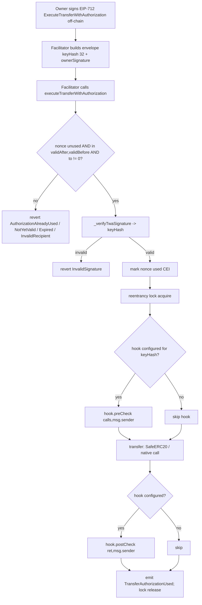
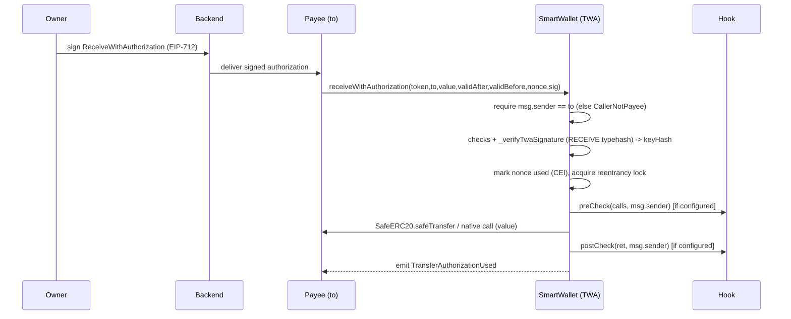

# DESIGN.md — Account-Level Transfer With Authorization (TWA)

> Canonical technical design for the TWA feature on the OKX SmartWallet account. Source of truth for contracts, modules, functions, state, events, errors, fund flows, and the state machine. Generated directly from the PRD (`docs/process/REQUIREMENTS.md`), the EIP draft supplement, the verified existing codebase, the Circle EIP-3009 technical context, and the selected pattern references (account-abstraction, upgradeability). `REQUIREMENTS_ANALYSIS.md` is used only as a coverage/readiness index.
>
> Target chain: EVM, Ethereum mainnet (chainId 1), **Cancun**. codebase_mode: `existing_code_change` (initial). Solidity `^0.8.29`, Foundry.

---

## 1. Design Goals and Non-goals

### 1.1 Smart-contract responsibilities (on-chain)
- Implement `ITransferWithAuthorization` (PRD §2.1, FR-1..FR-5) **exactly** — function/event/error signatures are frozen; only the function bodies are designed here.
- Verify an off-chain EIP-712 owner signature via the PRD-fixed `_verifyTwaSignature` path (PRD §7, G-4), reusing the account's existing validator routing.
- Enforce one-time, time-windowed, recipient-bound authorization with a random `bytes32` nonce isolated from the account's native/4337 nonce (PRD §5 invariants 1-4, G-3).
- Settle the transfer (any ERC-20 or native asset) **through the signing key's spending-policy hook**, isomorphic with the existing `execute` path (PRD FR-1 rule 6, §5 invariant 5, G-5).
- Mark the nonce used **before** the transfer (CEI) and guard the native-asset path with a transient-storage reentrancy lock (PRD NFR-2, R-1).
- Allow the owner to cancel an unused authorization (FR-3) and expose nonce-state + domain-separator getters and ERC-165 detection (FR-4, FR-5).

### 1.2 Non-goals / off-chain responsibilities
- No batch authorization, no on-chain token whitelist / per-account limits, no on-chain pause/kill-switch, no paymaster, no multi-chain-one-signature, no standing allowance (PRD §3.2 — all covered elsewhere or out of scope).
- Off-chain (PRD §8.2): EIP-712 payload construction, signature collection, relayer selection/submission, receive UI metadata, event indexing, and per-key hook policy configuration.

### 1.3 PRD inputs used directly
PRD §2.1 (interface), §2.2-2.5, FR-0..FR-5 (+ all ACs + FR-1 boundary cases), §5 (states + 5 invariants), NFR-1..4, §7 (technical reqs + `_verifyTwaSignature` 7-step spec + typehash visibility + domain + UUPS/ERC-7201 + cancun + EIP-170), §8 (data + authority), DEP-1..8, §10 (8 metrics), R-1..R-7/R-9, §12 (handoff). EIP draft: the 3 typehash constant values, `NATIVE_ASSET`, `INTERFACE_ID`, digest derivation, nonce model.

### 1.4 PRD-to-TD boundary (PRD §12)
**PRD-fixed (adopted unchanged):** `_verifyTwaSignature` path + `keyHash(32)‖ownerSignature` envelope; direct `hashTypedData(structHash)` digest with **no** ERC-1271/`MessageSignLib` wrapping; the same `keyHash` routes validator **and** selects the hook; the three typehashes + `INTERFACE_ID` are `public constant`; EIP-712 domain = account's existing (`name="SmartWallet"`, `version="1.1.0"`, `verifyingContract = account`); cross-version replay protection via EIP-712 typehash + domain.
**TD-decided here / in Stage 4.0:** interface file layout; single-contract-inline mixin; `SIGNATURE_ENVELOPE_MIN_LENGTH` value (design: 32); hook-call shape through the `_batchCall` semantics; transient reentrancy lock implementation; ERC-7201 namespace string + slot; `optimizer_runs` binary-search for EIP-170.

---

## 2. Project Structure

| Item | Value |
|------|-------|
| Chain / framework | EVM (ETH mainnet chainId 1, Cancun) / Foundry |
| Solidity | `^0.8.29` (existing, `foundry.toml:5`) |
| Source path | `src/` (Stage 1.0 confirmed) |
| Test path | `test/` |
| Script path | `script/` |
| Libs | `lib/` (OpenZeppelin, solady, account-abstraction, webauthn-sol, smart-wallet-recovery) |
| codebase_mode | `existing_code_change` (initial / first-time adoption) |
| Baseline build | **FAILED** — root cause is environmental only: private/nested deps `smart-wallet-recovery` (auth required) and `webauthn-sol`→`FreshCryptoLib` (nested submodule) unresolved in the bootstrap environment (Stage 1.0 `output.md`, `EXISTING_CODEBASE_BASELINE.md`). Not a source defect; Stage 4.0 must restore dependency access. See Risk Register RR-4. |

### File / module plan
| File | Change | Type |
|------|--------|------|
| `src/interfaces/ITransferWithAuthorization.sol` | **new** — frozen interface from PRD §2.1 (functions, events, errors) | B |
| `src/TransferWithAuthorization.sol` | **new** — abstract mixin implementing the interface; inherited by `SmartWallet`; compiled inline (no facade / no external library link — PRD §7) | B |
| `src/SmartWallet.sol` | **modified** — add `TransferWithAuthorization` to the inheritance list; expose `supportsInterface` override | A |
| `src/FallbackHandler.sol` (or mixin override) | **modified** — add `INTERFACE_ID = 0x86c5a9e1` to ERC-165 detection | A |
| `foundry.toml` | **modified** — `evm_version` `shanghai` → `cancun`; re-tune `optimizer_runs` for EIP-170 | A |

The new authorization-nonce storage lives in its **own** ERC-7201 namespace via an assembly storage accessor (PRD §7, R-4), independent of the account's existing `layout at 0x653ff6…` region.

---

## 2.5. Existing Context Baseline and Delta Plan

> Required for `existing_code_change`. Evidence: `.oli-work/stage02-analysis/existing-code.md`, `.oli-work/stage02-analysis/patterns.md`, `.oli-work/stage02-analysis/security.md`, and the direct file reads cited below.

### Code / docs / tests / scripts reviewed
`src/SmartWallet.sol`, `ExecutionManager.sol`, `Types.sol`, `OwnerManager.sol`, `ValidationManager.sol`, `ERC712.sol`, `ERC7201.sol`, `SmartWalletEntry.sol`, `FallbackHandler.sol`, `BaseAuthorization.sol`, `NonceManager.sol`, `interfaces/IHook.sol`, `libraries/Static.sol`, `libraries/DecodeLib.sol` (referenced), `foundry.toml`; technical context `contracts/v2/EIP3009.sol`; existing test inventory (`test/Hook.t.sol`, `test/Validation.t.sol`, `test/Execution.t.sol`, `test/ERC712.t.sol`, etc., from the baseline inventory). Stage 1.0 `output.md` and `EXISTING_CODEBASE_BASELINE.md`.

### Existing architecture / patterns / conventions
- **Modular smart account**: `SmartWallet` (abstract) inherits ERC7201, ERC4337Account, OwnerManager, NonceManager, ValidationManager, ExecutionManager, ERC712, FallbackHandler, Initializable, AllowanceManager, UUPSUpgradeable; deployed as `SmartWalletEntry` (`SmartWallet.sol:29-42`, `SmartWalletEntry.sol:9`).
- **Key model**: owners are `keyHash`es mapped to validators + packed settings (`isAdmin | expiration | hook`) in `OwnerManager` (`_ownerValidators`, `_ownerSettings`, `getHook`/`isAdmin`/`getExpiration`, `getVerifiedValidator`).
- **Hook pattern**: `_batchCall(Call[],keyHash)` looks up the per-key hook and runs `IHook.preCheck(calls,msg.sender)` then `postCheck(ret,msg.sender)` around `_call`s (`SmartWallet.sol:146-172`).
- **Signature/validation**: `getVerifiedValidator(keyHash)` + `_validateSignature(validator,keyHash,digest,sig)`; ECDSA=addr(1), passkey=addr(2), external validators via try/catch fail-closed (`ValidationManager.sol:29-67`).
- **EIP-712**: solady; `hashTypedData(structHash)` (`ERC712.sol:13`), domain `SmartWallet`/`1.1.0` (`Static.sol:22-23`).
- **Storage**: ERC-7201 namespaced; existing `SmartWallet.ERC7201.CustomStorage` root `0x653ff6dc…`; whole account uses Solidity native `layout at` directive.
- **Conventions**: custom errors in interfaces (`ISmartWallet`, `IOwnerManager`); events per state change; SafeERC20 for ERC-20 (`IERC20(token).safeTransfer`); NatSpec on external APIs; `onlySelf`/`onlyFactory`/`onlyEntryPoint` modifiers.

### Requested delta, preserved behavior, compatibility
- **Delta**: add TWA settle interface (FR-1..FR-5) reusing the above primitives. Type B for the TWA logic; Type A for ERC-165 + inheritance + `foundry.toml`.
- **Preserved**: all existing execute/relayer/UserOp paths and their 38-byte signature envelope; owner/validator/hook/nonce semantics; existing ERC-7201 `CustomStorage` layout; existing ERC-165 ids; UUPS `onlySelf` upgrade authority; EIP-712 domain. TWA neither modifies nor reorders existing storage.
- **Compatibility**: ABI is purely additive (new external functions, events, errors, one new ERC-165 id). Event schema/custom errors of existing surfaces unchanged. Deployment addresses unaffected (same upgradeable account). Backend indexing of existing events unaffected.

### Global impact review
- **Storage**: new nonce mapping in an independent ERC-7201 namespace — no overlap with `0x653ff6dc…` (verified non-collision is a Stage 4.0 storage-layout gate; R-4).
- **Bytecode (EIP-170)**: TWA functions + three `public constant` typehash getters + `INTERFACE_ID` increase runtime bytecode; `optimizer_runs` must be re-tuned and `forge build --sizes` re-checked (R-9, NFR-1).
- **Build/EVM**: `evm_version` must move shanghai→cancun for EIP-1153; cancun is a superset of shanghai, so existing contracts remain valid (DEP-6).
- **Security invariants**: TWA reuses the validator + hook primitives without altering them; the new reentrancy surface is the native `to.call{value}`, mitigated by CEI + transient lock (R-1). No broader impact on existing access control, fund flows, or state machines was found — TWA only adds new entry points.

### Existing Code Risk Register

| Area / File | Observed risk or smell | Delta touches it? | Handling |
|-------------|------------------------|-------------------|----------|
| RR-1 `foundry.toml:6` `evm_version="shanghai"` | EIP-1153 `TSTORE`/`TLOAD` (the PRD-mandated transient reentrancy lock) will not compile under shanghai. | Yes — TWA introduces the transient lock | **fix-in-delta**: Stage 4.0 sets `evm_version=cancun` (PRD §7, DEP-6). |
| RR-2 `ExecutionManager._call` (`:11-40`) | Raw assembly `call` with no return-data capture: a non-standard ERC-20 that returns `false` would not revert on the `execute` path. | TWA depends on hook semantics but uses **SafeERC20** for its own ERC-20 leg, so TWA is not exposed; the `execute` path itself is out of TWA scope. | **flag-out-of-scope**: TWA uses SafeERC20 per PRD §12; changing `execute` is out of scope for this delta. |
| RR-3 `foundry.toml:9` `optimizer_runs=2000` | Adding TWA + public-constant typehash getters grows runtime bytecode; account may approach the 24,576-byte EIP-170 ceiling. | Yes | **fix-in-delta**: Stage 4.0 binary-searches `optimizer_runs` and re-verifies `--sizes` + gas (R-9, NFR-1). |
| RR-4 baseline build (deps) | Build fails because `smart-wallet-recovery` (private auth) and `webauthn-sol`→`FreshCryptoLib` (nested submodule) sources are unresolved in this environment. | No — environmental, not code | **flag-out-of-scope**: Stage 4.0 restores dependency access; not a TWA design defect (Stage 1.0 baseline `failed`). |
| RR-5 `FallbackHandler.supportsInterface` flat `||` if-chain (`:32-44`) | Adding a new interface id requires editing the chain or overriding. | Yes | **fix-in-delta**: TWA overrides `supportsInterface` returning `id == INTERFACE_ID \|\| super.supportsInterface(id)`. |

No other pre-existing bug or unsound pattern was observed in the reviewed code that the TWA delta touches or depends on.

---

## 3. Architecture Overview

| Module | Responsibility | Relationships | External deps |
|--------|----------------|---------------|---------------|
| `ITransferWithAuthorization` (new interface) | Frozen ABI: 5 functions, 2 events, 5 errors (PRD §2.1) | implemented by the mixin | — |
| `TransferWithAuthorization` (new mixin) | TWA logic: verify, nonce/window checks, CEI mark-used, hook-wrapped settle, cancel, getters, ERC-165 id | inherited by `SmartWallet`; calls `OwnerManager.getVerifiedValidator`/`getHook`/`_ownerSettings`, `ValidationManager._validateSignature`, `ERC712.hashTypedData`, `IHook`, `ExecutionManager` (semantics) | OZ `SafeERC20`/`IERC20`; solady `EIP712` (via `ERC712`) |
| `OwnerManager` (existing) | validator routing + per-key settings/hook | provides `getVerifiedValidator`, `getHook`, `isAdmin`, `_ownerSettings` | — |
| `ValidationManager` (existing) | signature validation dispatch (ECDSA/passkey/external) | provides `_validateSignature` | ECDSA/Passkey validator libs |
| `ERC712` (existing) | EIP-712 typed-data hashing + domain | provides `hashTypedData` | solady `EIP712` |
| `FallbackHandler` (existing) | ERC-165 detection | extended for `INTERFACE_ID` | — |
| `BaseAuthorization` (existing) | `onlySelf` | used by cancel form B | — |
| Per-key Spending Policy Hook (external, owner-configured) | enforces per-key limits/whitelist via `preCheck`/`postCheck` | invoked by the settle path | semi-trusted (owner-configured) |

**Core principle (G-5 / R-7):** the single `keyHash` recovered and verified by `_verifyTwaSignature` is used both to route the validator **and** to select the spending-policy hook — structurally guaranteeing "the key that signed == the key whose hook constrains the spend", so a restricted session/agent key cannot use TWA to bypass its own hook.

---

## 4. Architecture Diagrams

### 4.1 Architecture / component diagram
```mermaid
graph TD
    Relayer[Relayer / Facilitator] -->|executeTransferWithAuthorization| TWA
    Payee[Payee contract] -->|receiveWithAuthorization| TWA
    Self[Account self-call / owner via execute] -->|cancelTransferAuthorization| TWA
    subgraph SmartWalletEntry (UUPS account)
      TWA[TransferWithAuthorization mixin]
      OM[OwnerManager: getVerifiedValidator / getHook / _ownerSettings]
      VM[ValidationManager: _validateSignature]
      E712[ERC712: hashTypedData / domain]
      EM[ExecutionManager: _call semantics]
      NS[(ERC-7201 TWA namespace: mapping bytes32 -> bool)]
    end
    TWA --> OM
    TWA --> VM
    TWA --> E712
    TWA --> NS
    TWA -->|preCheck/postCheck| Hook[Per-key Spending Policy Hook]
    TWA -->|SafeERC20.safeTransfer / native call| Asset[ERC-20 token / native recipient]
```

### 4.2 Core business flow (facilitator settle, FR-1)


### 4.3 Sequence diagram (receive path, FR-2)


### 4.4 State transition diagram (authorization nonce)
```mermaid
stateDiagram-v2
    [*] --> Unused
    Unused --> Used: executeTransferWithAuthorization / receiveWithAuthorization (success)
    Unused --> Canceled: cancelTransferAuthorization (form A signed / form B self-call)
    Used --> [*]
    Canceled --> [*]
    note right of Used: terminal; on-chain flag = true
    note right of Canceled: terminal; treated as used (flag = true)
```

---

## 5. Contract / Module Relationship Design

- **Inheritance**: `TransferWithAuthorization` is an abstract mixin added to `SmartWallet`'s inheritance list (alongside the existing managers). It is compiled inline into the single `SmartWalletEntry` bytecode — no separate deployed facade and no linked external library (PRD §7 "单合约内联").
- **Composition**: the mixin does not own validator/hook state; it reads `OwnerManager` state (`_ownerSettings`, `getHook`, `getVerifiedValidator`) and calls `ValidationManager._validateSignature` and `ERC712.hashTypedData`. It owns only its ERC-7201 nonce namespace.
- **Library usage**: OZ `SafeERC20`/`IERC20` for the ERC-20 leg (PRD §12 — preserve return-value check); solady `EIP712` indirectly via `ERC712`.
- **Storage separation**: the TWA nonce mapping is in a dedicated ERC-7201 namespace accessed by assembly (`_getTransferAuthorizationStorage`), independent from the account's `layout at 0x653ff6…` region (PRD §7, R-4, DEP-3).
- **Permission/business relationship**: `execute`-class authorization (validator routing + hook) is reused; TWA adds permissionless `execute`/payee-gated `receive` entry points plus owner-gated `cancel`. UUPS upgrade authority (`_authorizeUpgrade onlySelf`) is unchanged.

---

## 6. Module Design — `TransferWithAuthorization`

| Aspect | Detail |
|--------|--------|
| Name | `TransferWithAuthorization` (abstract mixin) implementing `ITransferWithAuthorization` |
| Responsibility | All TWA behavior: verify, nonce/window/recipient checks, CEI mark-used, hook-wrapped settle, cancel, getters, ERC-165 |
| Owned state | ERC-7201 namespace `SmartWallet.ERC7201.TransferAuthorization` → `struct { mapping(bytes32 => bool) authorizationStates; }`; one transient-storage reentrancy flag (EIP-1153) |
| Public constants | `EXECUTE_TRANSFER_WITH_AUTHORIZATION_TYPEHASH`, `RECEIVE_WITH_AUTHORIZATION_TYPEHASH`, `CANCEL_TRANSFER_AUTHORIZATION_TYPEHASH`, `INTERFACE_ID = 0x86c5a9e1`, `NATIVE_ASSET` (= `Static.NATIVE_ETH`), `SIGNATURE_ENVELOPE_MIN_LENGTH = 32` — all `public constant` (PRD §7) |
| Exposed functions | FN-001..FN-006 (external); FN-101..FN-106 (internal/private helpers + modifier) |
| Dependencies | `OwnerManager`, `ValidationManager`, `ERC712`, `IHook`, OZ SafeERC20 |
| Permission model | execute = permissionless; receive = `msg.sender==to`; cancel = owner-signed (form A) or `onlySelf` (form B); getters = view |
| Invariants | INV-NONCE-ONCE, INV-NONCE-ISOLATION, INV-RECIPIENT-BOUND, INV-CEI, INV-HOOK-ISOMORPHISM, INV-TIME-WINDOW, INV-TYPESEP (see §10) |
| Failure modes | `AuthorizationAlreadyUsed`, `AuthorizationNotYetValid`, `AuthorizationExpired`, `InvalidRecipient`, `CallerNotPayee`, `InvalidSignature` + `NonAdminSelfCall` (existing base errors, reused), reentrancy-lock revert, hook revert, SafeERC20/native-call revert |
| Events | `TransferAuthorizationUsed`, `TransferAuthorizationCanceled` |
| Testing focus | replay/cross-type/cross-chain, time-window boundaries, hook enforcement vs execute, native reentrancy, non-standard ERC-20 (USDT), zero-recipient, ERC-1271-wrapped-digest must-fail |

### Public constant values (authoritative — EIP draft; do not recompute differently)
```
EXECUTE_TRANSFER_WITH_AUTHORIZATION_TYPEHASH = 0xe751bf1b144414a77b82ede1d2a433edc347fef283ab5e53e96f438392517b3c
RECEIVE_WITH_AUTHORIZATION_TYPEHASH          = 0xd8a04c474fcb45b6fb4b17a80506c180af4818903f1ace6c1ff59053338529fd
CANCEL_TRANSFER_AUTHORIZATION_TYPEHASH       = 0xf30be15aedf9b01d0dac5525241af3753865a4968ffb9fb1a7ad6d2553d29f8e
INTERFACE_ID                                 = 0x86c5a9e1   // executeTransferWithAuthorization.selector ^ receiveWithAuthorization.selector
NATIVE_ASSET                                 = 0xEeeeeEeeeEeEeeEeEeEeeEEEeeeeEeeeeeeeEEeE   // = Static.NATIVE_ETH (ERC-7528)
```
Type strings (for the typehashes, must match exactly):
- `ExecuteTransferWithAuthorization(address token,address from,address to,uint256 value,uint256 validAfter,uint256 validBefore,bytes32 authorizationNonce)`
- `ReceiveWithAuthorization(address token,address from,address to,uint256 value,uint256 validAfter,uint256 validBefore,bytes32 authorizationNonce)`
- `CancelTransferAuthorization(bytes32 authorizationNonce)`

---

## 7. Interface Design — `ITransferWithAuthorization` (frozen, PRD §2.1)

> Signatures are frozen by the PRD; only bodies are implemented. Backend integration details are in `INTERFACE_SPEC.md`; do not duplicate behavior there.

```solidity
interface ITransferWithAuthorization {
  event TransferAuthorizationUsed(address indexed token, address indexed from, address indexed to, uint256 value, bytes32 authorizationNonce);
  event TransferAuthorizationCanceled(address indexed authorizer, bytes32 indexed authorizationNonce);

  error AuthorizationAlreadyUsed(bytes32 authorizationNonce);
  error AuthorizationNotYetValid(uint256 validAfter);
  error AuthorizationExpired(uint256 validBefore);
  error InvalidRecipient(address to);
  error CallerNotPayee(address caller, address to);

  function executeTransferWithAuthorization(address token, address to, uint256 value, uint256 validAfter, uint256 validBefore, bytes32 authorizationNonce, bytes calldata signature) external; // permissionless
  function receiveWithAuthorization(address token, address to, uint256 value, uint256 validAfter, uint256 validBefore, bytes32 authorizationNonce, bytes calldata signature) external; // only msg.sender == to
  function cancelTransferAuthorization(bytes32 authorizationNonce, bytes calldata signature) external;
  function transferAuthorizationState(bytes32 authorizationNonce) external view returns (bool used);
  function TRANSFER_AUTHORIZATION_DOMAIN_SEPARATOR() external view returns (bytes32);
}
```

Notes:
- `from` is **not** a function parameter; the contract uses `address(this)` and includes it in the signed struct (EIP draft "from in EIP-712 but not in function parameters").
- `InvalidSignature()` (used by the verification path and FR-1-AC-4 / FR-1 boundary cases) is the **existing** `ISmartWallet.InvalidSignature()` error, reused — it is intentionally not part of the frozen interface error set.
- `NonAdminSelfCall()` (FN-103 step 3 self-target guard; DR-003) is likewise the **existing** `ISmartWallet.NonAdminSelfCall()` error (`ISmartWallet.sol:10`), reused for execute-isomorphism and intentionally not part of the frozen TWA interface error set.
- `NativeTransferFailed()` from the EIP reference impl is **not** adopted (PRD §2.1 is authoritative); a failed native send reverts via the low-level call's bubble-up / an explicit revert (Stage 4.0 may reuse an existing native-transfer error or revert with returndata).

---

## 8. Source of Truth and State Model

### 8.1 On-chain state owned by TWA
| State | Type | Owner | Authority | Notes |
|-------|------|-------|-----------|-------|
| `authorizationStates` | `mapping(bytes32 => bool)` in ERC-7201 namespace `SmartWallet.ERC7201.TransferAuthorization` | TWA mixin | on-chain authoritative (PRD §8.1 "授权状态", §8.2) | `true` = used **or** canceled (collapsed; PRD inv 1 + FR-4 "被 cancel 的 nonce 视为已用"). Distinction observable only via events (NFR-4). |
| reentrancy flag | transient (EIP-1153) | TWA mixin | transient (cleared each tx) | guards native settle (R-1, NFR-2) |

### 8.2 State read from existing modules (not owned by TWA)
`_ownerSettings[keyHash]` (packed isAdmin/expiration/hook), `_ownerValidators[keyHash]`, the EIP-712 domain separator (solady), `Static.NATIVE_ETH`.

### 8.3 Authorization data object (PRD §8.1 — signed, not persisted)
`{ token, from(=address(this)), to, value, validAfter, validBefore, authorizationNonce }` + `operationType` realized as the choice of typehash (Execute vs Receive). Only used as signature-verification input; never stored.

### 8.4 Authority boundaries (PRD §8.2)
- On-chain authoritative: fund movement, nonce used/canceled state, terminal state, hook-internal accounting.
- Off-chain authoritative: signature payload construction, relayer selection, receive UI metadata, event index history, policy parameter config.

### 8.5 Schema-extension analysis (Phase-7 gate)
The only new persistent field is `authorizationStates` (`mapping(bytes32 => bool)`), which is **directly PRD-defined** (PRD §8.1 "authorizationNonce, used 标志" + FR-4 "用 `mapping(bytes32 => bool)` 跟踪"). It introduces **no** new field absent from the PRD data schema. It does **not** change the semantics of any PRD-defined field: "used" and "canceled" both set the flag to `true`, exactly as the PRD mandates ("被 cancel 的 nonce 视为已用") — the cancel/use distinction is intentionally event-only (NFR-4), not a new stored marker. The transient reentrancy flag is non-persistent and is driven by PRD NFR-2/R-1, not a data-schema field. No undocumented schema extension exists.

---

## 9. Function Specification (canonical)

> Stable function ids. PRD ids cited directly. `$` denotes the ERC-7201 TWA storage struct.

### FN-001 `executeTransferWithAuthorization` — new — PRD FR-1, G-1/G-2/G-3
- Visibility: `external`. Caller: **any address** (permissionless relayer/facilitator; FR-1 rule 8). Not payable (native funded from account balance).
- Params: `address token, address to, uint256 value, uint256 validAfter, uint256 validBefore, bytes32 authorizationNonce, bytes calldata signature`.
- Modifier: `nonReentrantTwa` (FN-106).
- Preconditions / checks (in order):
  1. `to != address(0)` else revert `InvalidRecipient(to)` (security-derived SD-1; prevents silent native burn). (Also reject `to == NATIVE_ASSET` — SD-2.)
  2. delegate to FN-102 `_authorizeAndSettle(EXECUTE_TRANSFER_WITH_AUTHORIZATION_TYPEHASH, token, to, value, validAfter, validBefore, authorizationNonce, signature)`.
- State changes: `$.authorizationStates[authorizationNonce] = true` (before transfer, CEI).
- Events: `TransferAuthorizationUsed(token, address(this), to, value, authorizationNonce)`.
- Reverts: `AuthorizationAlreadyUsed`, `AuthorizationNotYetValid`, `AuthorizationExpired`, `InvalidRecipient`, `InvalidSignature`, `NonAdminSelfCall` (non-admin self-target settle, FN-103 step 3), hook revert, SafeERC20/native-call failure, reentrancy-lock revert.
- ACs: FR-1-AC-1..8 + FR-1 boundary 1/2.

### FN-002 `receiveWithAuthorization` — new — PRD FR-2
- Visibility: `external`. Caller: **only `to`** (`msg.sender == to`, FR-2 rule 1). Modifier: `nonReentrantTwa`.
- Params: identical to FN-001.
- Checks: (1) `msg.sender == to` else revert `CallerNotPayee(msg.sender, to)`; (2) `to != address(0)` (SD-1; here `to == msg.sender`, so this also bars the zero caller); (3) delegate to FN-102 with `RECEIVE_WITH_AUTHORIZATION_TYPEHASH`.
- Distinct typehash ⇒ a receive authorization cannot be replayed through execute and vice-versa (INV-TYPESEP, FR-2-AC-3).
- Events / reverts: as FN-001 plus `CallerNotPayee`. ACs: FR-2-AC-1..4.

### FN-003 `cancelTransferAuthorization` — new — PRD FR-3
- Visibility: `external`. Caller: form A = any registered account key (via signature); form B = `address(this)` (self-call).
- Params: `bytes32 authorizationNonce, bytes calldata signature`.
- Checks:
  1. if `$.authorizationStates[authorizationNonce]` → revert `AuthorizationAlreadyUsed(authorizationNonce)` (FR-3 rule 1, FR-3-AC-3).
  2. if `signature.length == 0` (form B): require `msg.sender == address(this)` (reuse `onlySelf` semantics, `BaseAuthorization.sol:12`) else revert `NotFromSelf` (FR-3 rule 3, FR-3-AC-2/AC-4).
  3. else (form A): `structHash = keccak256(abi.encode(CANCEL_TRANSFER_AUTHORIZATION_TYPEHASH, authorizationNonce))`; `_verifyTwaSignature(structHash, signature)` (FR-3 rule 2). The nonce is account-scoped, so any registered key may cancel (assumption A-6; matches EIP "owner(s)").
- State changes: `$.authorizationStates[authorizationNonce] = true` (canceled treated as used; FR-3 rule 4).
- Events: `TransferAuthorizationCanceled(address(this), authorizationNonce)` (authorizer = account; matches EIP reference impl).
- No fund movement → no hook, no reentrancy lock required (lock optional for uniformity).
- ACs: FR-3-AC-1..4.

### FN-004 `transferAuthorizationState` — new — PRD FR-4
- `external view returns (bool used)`; returns `$.authorizationStates[authorizationNonce]` (true if used **or** canceled). ACs: FR-4-AC-1/AC-2.

### FN-005 `TRANSFER_AUTHORIZATION_DOMAIN_SEPARATOR` — new — PRD FR-4
- `external view returns (bytes32)`; returns the account's EIP-712 domain separator (solady `_domainSeparator()` via `ERC712`). Same domain used for digests (DEP-2).

### FN-006 `supportsInterface` — modified (Type A) — PRD FR-5
- `external view returns (bool)`; returns `interfaceId == INTERFACE_ID || super.supportsInterface(interfaceId)`, preserving existing ids (`FallbackHandler.sol:32-44`). `INTERFACE_ID` is `public constant = 0x86c5a9e1`. ACs: FR-5-AC-1/AC-2.

### FN-101 `_verifyTwaSignature` — new (internal view) — PRD §7 (PRD-fixed 7-step spec; semantics MUST NOT change), G-4, R-3
- Signature: `_verifyTwaSignature(bytes32 structHash, bytes calldata signature) internal view returns (bytes32 keyHash)`.
- Steps (verbatim from PRD §7):
  1. if `signature.length < SIGNATURE_ENVELOPE_MIN_LENGTH` (32) → revert `InvalidSignature()` (FR-1 boundary 1).
  2. `keyHash = bytes32(signature[:32])`.
  3. `address validator = getVerifiedValidator(keyHash)`; if `validator == address(0)` → revert `InvalidSignature()` (FR-1 boundary 2; covers unregistered/expired keys).
  4. `bytes32 digest = hashTypedData(structHash)` — **direct** EIP-712 typed-data digest; NO ERC-1271/`MessageSignLib` wrapper (R-3; FR-1-AC-8 must fail for wrapped digests).
  5. if `!_validateSignature(validator, keyHash, digest, signature[SIGNATURE_ENVELOPE_MIN_LENGTH:])` → revert `InvalidSignature()` (FR-1-AC-4).
  6. return `keyHash` (used by FN-103 to select the hook — same keyHash for routing and hook ⇒ G-5/R-7).
- **Envelope layout (G-4):** `ownerSignature = signature[32:]` is the validator-specific payload (ECDSA = 65-byte `r,s,v`; built-in passkey = `abi.encode(PasskeyPubKey)(64)‖abi.encode(WebAuthnAuth,bytes32[])`; external = validator-defined). keyHash derivation per validator: ECDSA `keccak256(abi.encodePacked(addr))`, passkey `keccak256(abi.encodePacked(pubKeyX,pubKeyY))`. The full per-validator byte layouts, the 32-vs-38-byte prefix warning, and copyable construction references are in **`INTERFACE_SPEC.md` §8 (Validator-Specific Signature Envelope)** — backend/test handoff for G-4.

### FN-102 `_authorizeAndSettle` — new (private) — shared core for FN-001/FN-002
- Signature: `_authorizeAndSettle(bytes32 typeHash, address token, address to, uint256 value, uint256 validAfter, uint256 validBefore, bytes32 authorizationNonce, bytes calldata signature) private`.
- Steps:
  1. if `$.authorizationStates[authorizationNonce]` → revert `AuthorizationAlreadyUsed(authorizationNonce)` (FR-1 rule 2; FR-1-AC-2).
  2. if `block.timestamp <= validAfter` → revert `AuthorizationNotYetValid(validAfter)`; if `block.timestamp >= validBefore` → revert `AuthorizationExpired(validBefore)` — **open interval** `(validAfter, validBefore)` (FR-1 rule 3; FR-1-AC-3; matches Circle EIP-3009 context).
  3. `structHash = keccak256(abi.encode(typeHash, token, address(this), to, value, validAfter, validBefore, authorizationNonce))` (FN-104).
  4. `bytes32 keyHash = _verifyTwaSignature(structHash, signature)` (FN-101) (FR-1 rule 4).
  5. `$.authorizationStates[authorizationNonce] = true` — **CEI: mark used before transfer** (FR-1 rule 5; INV-CEI; FR-1-AC-4 ensures this line is not reached on bad signature, so the nonce is not consumed).
  6. `_settleWithHook(keyHash, token, to, value)` (FN-103) (FR-1 rule 6/7).
  7. `emit TransferAuthorizationUsed(token, address(this), to, value, authorizationNonce)` (FR-1 rule 9).
- Inputs sufficiency: `typeHash` distinguishes execute/receive; all signed fields are parameters or `address(this)`; `keyHash` flows to the hook selector — see Self-Consistency Lint §15.5.

### FN-103 `_settleWithHook` — new (private) — PRD FR-1 rule 6/7, §12, G-5, R-7
- Signature: `_settleWithHook(bytes32 keyHash, address token, address to, uint256 value) private`.
- Steps:
  1. `uint256 settings = _ownerSettings[keyHash]; address hook = getHook(settings);` (same resolution as `_batchCall`, `SmartWallet.sol:147-148`).
  2. Build a 1-element `Call[] memory calls` representing the transfer, **identical to what `execute` would build** so the hook applies the same accounting (FR-1-AC-7):
     - ERC-20: `calls[0] = Call({target: token, value: 0, data: abi.encodeCall(IERC20.transfer, (to, value))})`.
     - native (`token == NATIVE_ASSET`): `calls[0] = Call({target: to, value: value, data: ""})`.
  3. **Self-call guard (mirrors `_batchCall`, `SmartWallet.sol:152-164`):** `bool allowSelfCall = (keyHash == keccak256(abi.encodePacked(address(this)))) || isAdmin(settings);` then `if (calls[0].target == address(this) && !allowSelfCall) revert NonAdminSelfCall();`. `allowSelfCall` is derived from the **verified `keyHash`'s** `settings` (loaded in step 1) — **NOT** from `msg.sender`/`executor`, which under TWA is the relayer and would wrongly block an admin-signed self-target. `calls[0].target == address(this)` occurs only on the native leg with `to == address(this)`, or the ERC-20 leg with `token == address(this)`. (Ordering vs the hook is immaterial — any revert rolls back the whole tx, including the step-5 CEI write; placed before `preCheck` to fail fast.)
  4. if `hook != address(0)`: `bytes memory ret = IHook(hook).preCheck(calls, msg.sender)` (matches `_batchCall`'s call shape exactly, including `executor = msg.sender`; FR-1 rule 6). Over-limit/non-whitelist ⇒ hook reverts ⇒ whole tx reverts, nonce not consumed because the revert rolls back the CEI write too (FR-1-AC-6; see §10 note).
  5. Execute the transfer (FR-1 rule 7; PRD §12 "保留 SafeERC20 返回值校验"):
     - ERC-20: `IERC20(token).safeTransfer(to, value)` — preserves return-value validation (handles USDT-style non-standard returns).
     - native: `(bool ok, ) = to.call{value: value}(""); if (!ok) revert/bubble`.
  6. if `hook != address(0)`: `IHook(hook).postCheck(ret, msg.sender)`.
- **Design note 1 (RR-2 reconciliation):** the transfer is *expressed* as a `Call` for the hook (so the per-key SpendingPolicyHook parses it exactly as for `execute`), but the ERC-20 leg is *executed* via SafeERC20 rather than the raw `_call`, because `ExecutionManager._call` does not check ERC-20 return values and PRD §12 requires preserving that check. This is hook-semantics-isomorphic with `execute` (same Call, same keyHash-selected hook, same self-call guard per note 3, same accounting) while being strictly safer on non-standard tokens. The native leg matches `execute`'s `_call` semantics. `_settleWithHook` deliberately does **not** call `_batchCall` literally (that would route the ERC-20 leg through the return-value-blind `_call`); it replicates `_batchCall`'s hook-invocation semantics instead.
- **Design note 2 (executor semantics):** under TWA, `msg.sender` (passed as the hook `executor`) is the **relayer**, not the signing key — whereas for `execute` it is the key's own EOA. The per-key binding that guarantees G-5/R-7 comes from the hook being **selected by the verified `keyHash`** (`_ownerSettings[keyHash].hook`), not from `executor`. A SpendingPolicyHook MUST therefore derive the constrained key from its own per-key configuration / keyHash selection and MUST NOT key spending limits off `executor`; otherwise its accounting would diverge between `execute` (executor=key) and TWA (executor=relayer). This is a binding implementation/audit assumption (SECURITY_SPEC §9 item 12).
- **Design note 3 (self-call guard — REPLICATED for execute-isomorphism; DR-003):** `_batchCall` rejects `calls[i].target == address(this)` for non-admin keys (`NonAdminSelfCall`, `SmartWallet.sol:152-164`) to stop a restricted key from invoking the account's own `onlySelf` privileged functions. TWA **replicates** this guard (step 3) so INV-HOOK-ISOMORPHISM holds on the self-target path too. Behavior: native `to == address(this)`, or ERC-20 `token == address(this)`, ⇒ revert `NonAdminSelfCall` for a non-admin key; an admin / built-in `address(this)` key may self-target (a native self-send is a net-zero no-op). A normal ERC-20 payment to the account itself (`token = <external ERC-20>`, `to = address(this)`) is **not** a self-call — the built Call's `target` is `token`, not the account — and settles normally.
  - *Why replicate (not exempt):* without the guard the paths **diverge** — a non-admin native `to == address(this)` settle would **succeed** as an empty-calldata no-op via the account's `receive()` (`FallbackHandler.sol:10`), whereas the same transfer through `execute` **reverts** `NonAdminSelfCall`. There is no privilege-escalation or fund-loss in the un-guarded form (native uses empty calldata; the ERC-20 leg uses a fixed `transfer` selector that `fallback()` rejects with `revert()`, `FallbackHandler.sol:14-27`, so `token == address(this)` reverts on both paths) — but the *behavioral* divergence on the native leg contradicted the "isomorphic on every path" claim. The ERC-20 self-target guard is thus for **reason-uniformity** with `execute`, not safety; it must not be removed as "redundant". `NonAdminSelfCall` is the existing `ISmartWallet` error (`ISmartWallet.sol:10`), reused like `InvalidSignature` and intentionally not part of the frozen TWA interface set.

### FN-104 `_twaTransferStructHash` — new (private pure)
- `keccak256(abi.encode(typeHash, token, address(this), to, value, validAfter, validBefore, authorizationNonce))`. (May be inlined into FN-102.) Field order matches the type strings in §6.

### FN-105 `_getTransferAuthorizationStorage` — new (private pure) — PRD §7, R-4, DEP-3
- ERC-7201 accessor returning the TWA storage struct pointer:
```
bytes32 constant TWA_STORAGE_SLOT =
  keccak256(abi.encode(uint256(keccak256("SmartWallet.ERC7201.TransferAuthorization")) - 1)) & ~bytes32(uint256(0xff));
struct TransferAuthorizationStorage { mapping(bytes32 => bool) authorizationStates; }
function _getTransferAuthorizationStorage() private pure returns (TransferAuthorizationStorage storage $) { assembly { $.slot := TWA_STORAGE_SLOT } }
```
- The namespace string and slot value are finalized in Stage 4.0 and MUST be verified non-colliding with `0x653ff6dc…` (existing `CustomStorage`) via `forge inspect storageLayout` (R-4).

### FN-106 `nonReentrantTwa` — new (modifier) — PRD NFR-2, R-1
- Transient-storage (EIP-1153) reentrancy guard:
```
uint256 transient _twaLocked; // dedicated transient slot
modifier nonReentrantTwa() { if (_twaLocked != 0) revert ReentrantSettle(); _twaLocked = 1; _; _twaLocked = 0; }
```
- Applied to FN-001 and FN-002 (the value-moving paths). Requires `evm_version=cancun` (RR-1). Bounds the native-callback reentrancy surface; combined with CEI it makes same-authorization replay impossible and nested cross-authorization settles disallowed during a native callback.

---

## 10. State Machine

States (PRD §5): **Unused → {Used | Canceled}**, both terminal, mutually exclusive (PRD inv 1).
- Unused → Used: FN-001/FN-002 success.
- Unused → Canceled: FN-003 (form A or B).
- Used/Canceled: terminal; any further FN-001/FN-002/FN-003 on that nonce reverts `AuthorizationAlreadyUsed`.

On-chain encoding: a single `bool` per nonce (`true` = used|canceled). The Used-vs-Canceled distinction is **not** stored (PRD: canceled treated as used); it is observable only via the distinct events (`TransferAuthorizationUsed` vs `TransferAuthorizationCanceled`), satisfying NFR-4. **Backend consequence (DR-001):** because `transferAuthorizationState(nonce)`/`AuthorizationAlreadyUsed` cannot distinguish settled from canceled, off-chain settlement reconciliation MUST disambiguate by event and MUST NOT treat a canceled nonce as paid — this is a binding integration rule in `INTERFACE_SPEC.md` §6.1 and a Stage 7/8 verification item in `SECURITY_SPEC.md` §5/§9.

Reentrancy / replay / idempotency:
- **CEI** — nonce flag set before transfer (FN-102 step 5) prevents same-auth replay via reentrancy (PRD inv 4, R-1).
- **Transient lock** (FN-106) prevents nested settles during native callbacks.
- **Idempotency note (FR-1-AC-6):** if the hook (or transfer) reverts, the entire transaction — including the CEI flag write in FN-102 step 5 — is rolled back, so the nonce remains **Unused** ("nonce not consumed"). The flag is only durable when the whole call succeeds.
- **Cross-type** (INV-TYPESEP): distinct typehashes make an execute-signed authorization invalid for receive and vice-versa (FR-2-AC-3).
- **Cross-chain / cross-account**: EIP-712 domain (`chainId` + `verifyingContract`) binds each authorization to one chain and one account (PRD §11 R-3 area, EIP "Replay Protection").

---

## 11. Asset and Fund-flow Design

- **Custody**: funds are the account's own balance (`from = address(this)`); no escrow, no third-party custody.
- **Outflow authorization**: a single outflow per call, authorized by (valid owner signature over the bound `{token,to,value,window,nonce}`) AND (unused nonce) AND (within window) AND (hook policy, if configured). No inflow path is added.
- **Accounting before transfer**: nonce marked used before transfer (CEI). No internal balance accounting beyond the nonce flag; the asset balance is the token/native ledger itself.
- **Native vs ERC-20**: `token == NATIVE_ASSET` (0xEeee…EEeE) → native `to.call{value:value}` (checked); else → `SafeERC20.safeTransfer` (handles non-standard/no-return tokens, e.g. USDT — G-2, §10 token-coverage metric).
- **Fee/refund**: none (TWA moves exactly `value`; no protocol fee).
- **Stuck-fund prevention**: no funds are held by TWA; a failed transfer reverts the whole tx (FR-1-AC-5), leaving balances unchanged.
- **Balance conservation**: account balance decreases by exactly `value` to `to` on success; on any revert, balance is unchanged (atomicity). This is the value-conservation invariant; its enforcement points are the atomic revert on transfer failure (FN-103 step 5) and CEI (FN-102 step 5).

---

## 12. External Dependency and Trust Model (PRD §9 DEP-1..8)

| Dep | Trust assumption | Failure behavior |
|-----|------------------|------------------|
| DEP-1 existing validator system | trusted (audited, same repo) | missing ⇒ cannot verify; reused as-is |
| DEP-2 existing EIP-712 domain | trusted | domain mismatch ⇒ signature fails (correct) |
| DEP-3 ERC-7201 namespaced storage | trusted | new namespace must not collide (R-4 gate) |
| DEP-4 OZ SafeERC20 / ECDSA | trusted, version-locked (existing `lib/`) | reused |
| DEP-5 relayer / facilitator | untrusted | permissionless interface; relayer cannot alter outcome (INV-RECIPIENT-BOUND) |
| DEP-6 cancun EVM chain | required (mainnet/X Layer activated) | non-cancun ⇒ transient lock unsupported (RR-1; do not deploy) |
| DEP-7 existing Hook mechanism | semi-trusted (owner-configured per key) | a malicious/buggy hook can block its own key's spends (griefing of own key only); cannot exceed account authority |
| DEP-8 validator routing (`getVerifiedValidator` + `_validateSignature`) | trusted | reused; external validators fail-closed via try/catch |
| Per-key Spending Policy Hook | owner-configured (semi-trusted) | reverts roll back the whole settle (FR-1-AC-6) |
| Recipient `to` (native) | untrusted (can reenter) | bounded by CEI + transient lock |

---

## 13. Upgradeability / Governance / Admin Model

- **Upgradeable**: yes, **UUPS** (existing, solady `UUPSUpgradeable`; `SmartWallet.sol:23,366`). TWA does not change the proxy kind (preserved per pattern guidance).
- **Upgrade authority**: `_authorizeUpgrade` is `onlySelf` (`msg.sender == address(this)`) — reachable only through owner-authorized `execute`/`executeWithRelayer`/UserOp. TWA adds **no** new upgrade role (PRD §7 "沿用 SmartWallet owner，不新增升级权限角色").
- **Storage strategy**: ERC-7201 namespaced; the new TWA namespace is append-safe and independent; namespace string is fixed at deployment and never changed; no reordering of existing storage (Decision Card 4, R-4).
- **Initializer**: TWA adds no new constructor state and no new initializer; `_disableInitializers()` in the implementation constructor (`SmartWallet.sol:54`) is unaffected. The `authorizationStates` mapping starts empty (correct default).
- **Pause / recovery**: none added (PRD §3.2 out-of-scope); cancel + off-chain risk control is the documented mitigation.

---

## 14. Deployment and Initialization

- **Deployment shape**: unchanged — the account is deployed as the existing `SmartWalletEntry` UUPS account; TWA is inline in its bytecode. No new contract is deployed.
- **Constructor/init params**: none new. Existing `initialize(InitialOwner[])` is unchanged.
- **Build/EVM**: set `evm_version=cancun` (RR-1) and binary-search `optimizer_runs` so runtime bytecode ≤ 24,576 (EIP-170; NFR-1, R-9). solc `0.8.29` retained.
- **Chain/env**: first launch on a Cancun-active chain (DEP-6).
- **External address source of truth**: none new (no external addresses baked in; `NATIVE_ASSET` is a constant sentinel).
- **Post-deploy checks / smoke tests**: `supportsInterface(0x86c5a9e1) == true`; `TRANSFER_AUTHORIZATION_DOMAIN_SEPARATOR()` equals the account domain separator; `forge build --sizes` under the bytecode budget; a happy-path ERC-20 settle + a replay-revert on a fork.
- **Storage-layout gate**: `forge inspect SmartWalletEntry storageLayout` before/after to confirm the new TWA namespace does not collide with `CustomStorage` (R-4).
- **Upgrade path**: existing accounts adopt TWA via a UUPS upgrade authorized by `onlySelf`; a dry-run state-preservation test is required (Decision Card 1/4).

---

## 15. Requirement-to-Design Traceability

| PRD ID | Contract component | Function / interface | State / event / error | Security invariant | Test target |
|--------|--------------------|----------------------|-----------------------|--------------------|-------------|
| FR-1 | TWA mixin | FN-001 / FN-102 / FN-103 | `authorizationStates`; `TransferAuthorizationUsed`; AuthorizationAlreadyUsed/NotYetValid/Expired/InvalidRecipient/InvalidSignature | INV-NONCE-ONCE, INV-CEI, INV-RECIPIENT-BOUND, INV-HOOK-ISOMORPHISM, INV-TIME-WINDOW | unit+fuzz+invariant+integration |
| FR-2 | TWA mixin | FN-002 | `TransferAuthorizationUsed`; CallerNotPayee | INV-TYPESEP, INV-HOOK-ISOMORPHISM | unit + cross-type negative |
| FR-3 | TWA mixin | FN-003 | `TransferAuthorizationCanceled`; AuthorizationAlreadyUsed; NotFromSelf | INV-NONCE-ONCE | unit |
| FR-4 | TWA mixin | FN-004 / FN-005 | `authorizationStates`; domain separator | — | unit |
| FR-5 | TWA mixin / FallbackHandler | FN-006 | `INTERFACE_ID` | — | unit |
| §7 `_verifyTwaSignature` | TWA mixin | FN-101 | InvalidSignature | INV-RECIPIENT-BOUND (digest binding) | unit + R-3 negative |
| §5 inv 1 | TWA mixin | FN-102 / FN-003 | `authorizationStates` | INV-NONCE-ONCE | invariant |
| §5 inv 2 | TWA mixin | FN-105 | dedicated namespace | INV-NONCE-ISOLATION | storage-layout + invariant |
| §5 inv 3 | TWA mixin | FN-101 / FN-104 | signed digest | INV-RECIPIENT-BOUND | fuzz |
| §5 inv 4 | TWA mixin | FN-102 / FN-106 | CEI + lock | INV-CEI | invariant + reentrancy |
| §5 inv 5 | TWA mixin | FN-103 | hook calls | INV-HOOK-ISOMORPHISM | hook test + invariant |
| NFR-1 | build | §2/§14 | — | — | `--sizes`, gas report |
| NFR-2 | TWA mixin | FN-106 / FN-102 | transient lock | INV-CEI | reentrancy/invariant |
| NFR-3 | TWA mixin | FN-001/002/003 | access control | INV-HOOK-ISOMORPHISM | access-control matrix |
| NFR-4 | TWA mixin | events | `TransferAuthorizationUsed`/`Canceled` | — | event tests |
| Security-derived | TWA mixin | FN-001/FN-002 | InvalidRecipient | INV-NO-NATIVE-BURN (SD-1) | unit |
| §3.2 off-chain/out-of-scope | — | N/A | — | — | not implemented (rationale in REQUIREMENTS_ANALYSIS §8) |

---

## 15.5. Self-Consistency Lint

| Function / Claim | Declared invariant or equivalence | Inputs required | Signature provides them? | Resolution |
|------------------|-----------------------------------|-----------------|--------------------------|------------|
| FN-102 (shared by FN-001/FN-002) | execute and receive differ only by typehash (+ receive's `msg.sender==to`) | `typeHash` + all signed fields | Yes — `typeHash` is a parameter; signed fields are params or `address(this)` | consistent; INV-TYPESEP |
| FN-103 vs `_batchCall` | INV-HOOK-ISOMORPHISM: TWA hook enforcement + self-call rule == same-param `execute` on **every** path, modulo two **declared** non-divergences | `keyHash` (hook selector + `allowSelfCall`), `token`, `to`, `value` (Call contents) | Yes — `keyHash` returned by FN-101; `allowSelfCall` from `_ownerSettings[keyHash]`; token/to/value are params | The Call built in FN-103 is byte-identical to what `execute` builds, the hook is selected by the same keyHash that authorized the signature, **and the same self-call guard is applied (step 3, keyed off the verified keyHash) — so the native `to == address(this)` divergence is closed (DR-003)**. Holds on both ERC-20 and native paths. The two **intentional, documented** non-divergences: (i) hook `executor` = relayer under TWA vs key-EOA under `execute` (note 2 — hooks MUST key off keyHash, not executor); (ii) ERC-20 leg via SafeERC20 vs raw `_call` (note 1 — strictly safer, hook-transparent). Neither affects hook accounting or the self-call decision. |
| FN-101 keyHash dual-use | keyHash used for validator routing == keyHash used for hook selection (G-5/R-7, "signed key == constrained key") | single `keyHash` | Yes — one value returned and reused | consistent; no path lets the routed key differ from the hook-selected key |
| FN-102 CEI | INV-CEI: nonce flag set before transfer | `authorizationNonce` | Yes — parameter | flag write (step 5) strictly precedes `_settleWithHook` (step 6) |
| FN-102 window | INV-TIME-WINDOW: open interval `(validAfter, validBefore)` | `validAfter`, `validBefore`, `block.timestamp` | Yes — params + env | `<=` / `>=` comparisons implement open interval, matching the signed bounds and Circle EIP-3009 |
| FN-001/FN-002 recipient | INV-NO-NATIVE-BURN (SD-1): `to != address(0)` | `to` | Yes — parameter | guard precedes settle |

No cross-function equivalence depends on inputs the signature omits, and no equivalence holds only on a coincidental path. Every named invariant in §10 has a concrete enforcement function above.

---

## 16. Test Strategy Outline (for Stage 5.0/6.0)

- **Unit** (per FN): each AC (FR-1-AC-1..8, FR-2-AC-1..4, FR-3-AC-1..4, FR-4-AC-1..2, FR-5-AC-1..2) + FR-1 boundary 1/2; getters; `supportsInterface` true/false.
- **Signatures / replay (security)**: R-3 negative — an ERC-1271/`MessageSignLib`-wrapped digest MUST fail (FR-1-AC-8, §10 metric "旧 ERC-1271 包装 digest 验签必败 100%"); cross-type replay (execute↔receive) MUST fail; cross-chain/cross-account replay MUST fail; envelope length < 32 reverts; unregistered/expired keyHash reverts; real ECDSA **and** passkey end-to-end (DEP-8, G-4) — **construct the envelopes per `INTERFACE_SPEC.md` §8** (ECDSA = `keyHash(32)‖r,s,v(65)` = 97 bytes; built-in passkey = `keyHash(32)‖abi.encode(PasskeyPubKey)(64)‖abi.encode(WebAuthnAuth,bytes32[])`; **32-byte prefix, no `validUntil`** — reuse `HelperLib`/`PasskeyValidator.t.sol::_createBuiltinPasskeySignature` minus its `validUntil`). A regression that a 38-byte (execute-style) prefix fails is recommended.
- **Asset paths**: standard ERC-20, non-standard/no-return token (USDT), and native — all pass (G-2, §10 token coverage); insufficient balance reverts whole tx (FR-1-AC-5); `to == address(0)` reverts `InvalidRecipient` (SD-1).
- **Reentrancy**: malicious native recipient reentering `executeTransferWithAuthorization` / `receiveWithAuthorization` cannot replay (CEI) and cannot nest (transient lock); requires cancun.
- **Hook / access control (invariant + property)**: configured key over-limit/non-whitelist ⇒ revert, nonce not consumed (FR-1-AC-6); within policy ⇒ hook accounting identical to same-param `execute` (FR-1-AC-7, INV-HOOK-ISOMORPHISM); no-hook key spends unconstrained == execute current behavior (recorded residual R-7); TWA cannot bypass a configured hook (§10 metric "TWA 绕过 hook = 0").
- **Self-target settle (DR-003, INV-HOOK-ISOMORPHISM self-call parity)**: {admin, non-admin} × {native `to == address(this)`, ERC-20 `token == address(this)`} = 4 cases — non-admin ⇒ revert `NonAdminSelfCall`; admin native self-send ⇒ net-zero no-op success (nonce consumed); admin ERC-20 `token == address(this)` ⇒ natural fallback revert. **Plus a CONTROL test** that `token = <external ERC-20>, to = address(this)` still settles normally (guard must not over-block a legitimate self-receive). Extend the execute-vs-TWA hook-parity case to include a self-targeted call for an admin key.
- **Invariant tests**: INV-NONCE-ONCE, INV-NONCE-ISOLATION (never touches `_nonces`), INV-RECIPIENT-BOUND, INV-CEI, INV-HOOK-ISOMORPHISM, INV-TIME-WINDOW, INV-TYPESEP, value-conservation (§11).
- **Upgradeability / storage**: `forge inspect storageLayout` before/after (no collision with `0x653ff6dc…`); UUPS dry-run state preservation; non-`onlySelf` upgrade rejected.
- **Deterministic deployment / init**: `supportsInterface` + domain-separator post-deploy checks; `forge build --sizes` ≤ EIP-170 with chosen `optimizer_runs`; gas report ECDSA path < 120,000 (NFR-1, §10), passkey baseline reported separately.
- **EVM negative**: low-level native call failure bubbles; non-payable functions reject `msg.value` if applicable.
