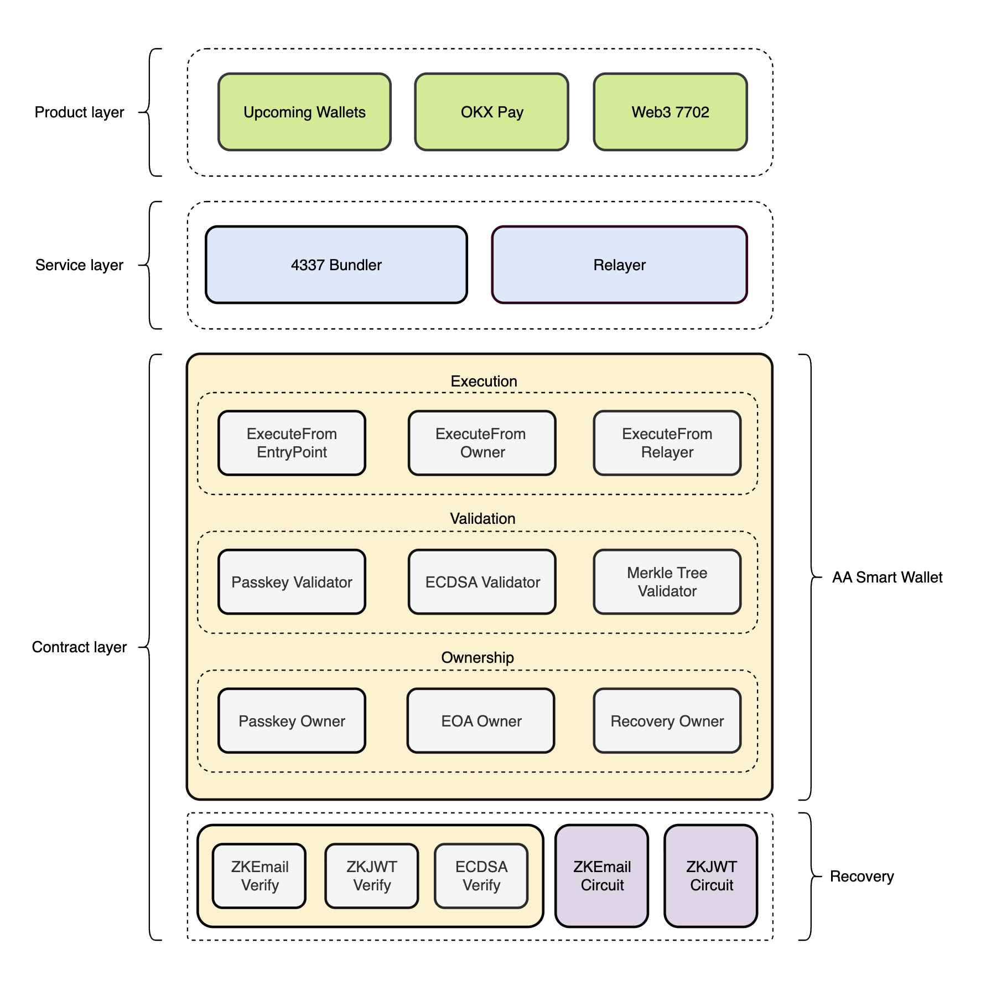
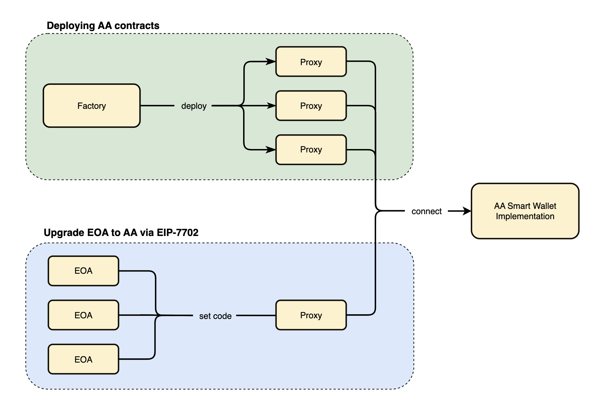
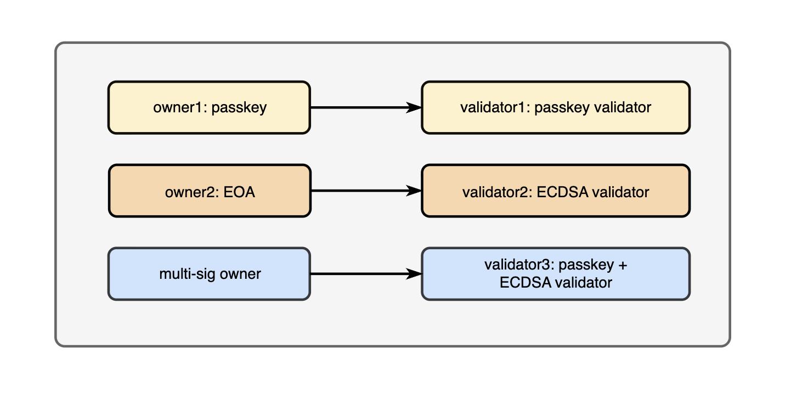
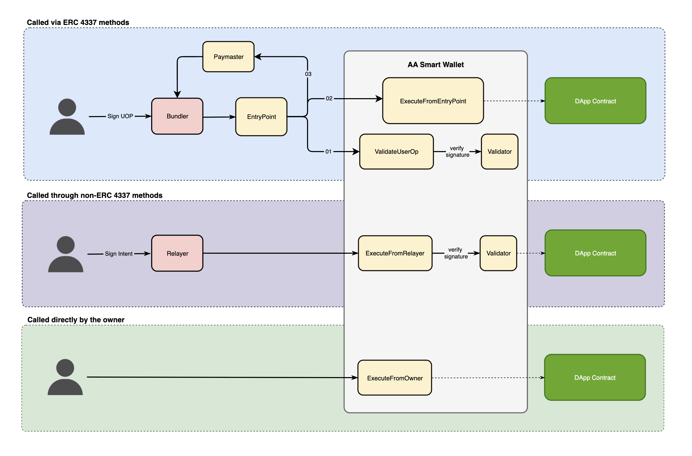
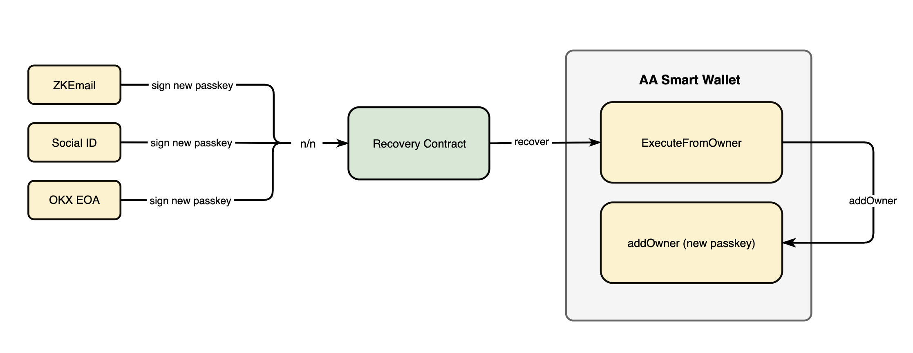

# Architecture Overview

## Background

Currently, our AA wallet technology has successfully served two main products: OKX Pay and 7702 project, and will soon be promoted and used in upcoming wallet products by OKX, and will support more business scenarios in the future.

- **OKX Pay** provides a Passkey wallet for novice exchange users that does not require private key backup, supports account recovery, and can be used gas-free on the XLayer chain. The focus of this solution is to reduce the threshold for Web3 usage, making it easy for users to quickly get started in payment and social scenarios. To this end, we have adopted the industry-proven ERC-4337 standard as the underlying account architecture.

- **Project 7702**: Targeting Web3 native users who already have EOA wallets, it supports upgrading traditional wallets to smart contract wallets, allowing users to enjoy the automation and flexibility advantages brought by AA. This solution focuses more on reducing on-chain operation costs, so we have designed a non-4337 architecture contract account system to achieve higher Gas efficiency.

## Unified Architecture Design

As our AA wallet service expands, we've designed a unified architecture to improve maintainability, flexibility, and reusability.

### Design Principles

1. **Full Reuse**: Leverage core advantages of existing schemes
2. **Industry Benchmarking**: Reference contract design from Uniswap, MetaMask, and Coinbase
3. **Unified Contract Account Architecture**: Meet differentiated needs of multiple products

### Key Characteristics

#### 1. Multi-Product Compatibility
- **Passkey wallets** for novice users
- **Advanced feature wallets** for native users
- **Exchange users** (KYC) vs **Web3 users** (non-KYC)
- **Shared underlying architecture**

#### 2. Flexible Account Recovery
- **Passkey recovery**
- **ZKEmail**
- **SocialID**
- **Product-specific access** as needed

#### 3. Easy Expansion and Maintenance
- **Modularization** of underlying architecture
- **Abstract design** for future products/features
- **Efficient development** of new capabilities

## Technical Architecture

### Core Components & Technical Decisions

1. **OwnerManager**: Multi-owner support with flexible permissions
   - Packed settings for efficient storage
   - Admin privileges: can call both internal and external functions
   - Non-admin owners: can only call external functions
   - Time-based access control for temporary permissions
   - Hook system for extensible functionality

2. **NonceManager**: 2-dimensional nonce management (key + sequence)
   - `uint256 nonce = uint192 key + uint64 value` structure
   - Concurrent execution support through different nonce keys
   - Parallel transaction processing without nonce conflicts
   - Chainless operations (nonce key = 196): limited to upgrade contract and addOwner functions only

3. **Execute**: Multiple execution modes (direct, relayer, 4337)
   - Direct execution for owner-only operations
   - Relayer execution with `validUntil` timestamp for signature expiration control
   - ERC-4337 compatible execution through EntryPoint with `validUntil` support in `validateUserOp`
   - Time-bound signatures prevent replay attacks and enable transaction deadlines

4. **Validator**: Support for ECDSA, Passkey, and Merkle Tree
   - Address-based routing for different authentication methods
   - Efficient proof verification through Merkle Tree integration
   - Multi-signature support for flexible ownership structures

5. **Recovery**: Flexible account recovery mechanisms
   - Multiple recovery methods: ZKEmail, SocialID, EOA
   - Recovery signer factory with deterministic address generation
   - Verifier-based recovery for secure account restoration

6. **ERC-4337 Compatibility**
   - Full compatibility with industry standard
   - Backward compatibility for existing integrations
   - Future-proof design for emerging standards

## Benefits of Unified Architecture

1. **Reduced Development Time**: Shared components across products
2. **Improved Security**: Centralized security audits and updates
3. **Better User Experience**: Consistent behavior across different wallet types
4. **Easier Maintenance**: Single codebase for core functionality
5. **Faster Innovation**: New features benefit all products simultaneously

## Essential Diagrams

### Contract Infrastructure Diagram

Shows the overall contract architecture and relationships between the product, service and contract layers.

### Account Creation Flow

Illustrates the account creation options including a Smart Wallet contract deployment, or delegation via EIP-7702.

### Owner and Validation Types

Multiple types of ownership are supported, each mapped to its specific validator and dynamically routed. The system automatically routes authentication requests based on the owner type, allowing the wallet to support diverse user preferences while maintaining security through appropriate validation mechanisms for each authentication type.

### Execution Flow

Shows the three execution modes and their flows: direct execution, relayer execution, and ERC-4337 execution paths via the Smart Wallet.

### Recovery Flow

Illustrates the account recovery process including recovery trigger, verification, and ownership addition.

